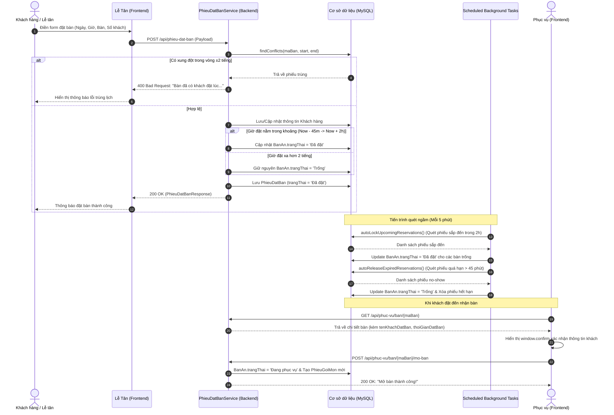
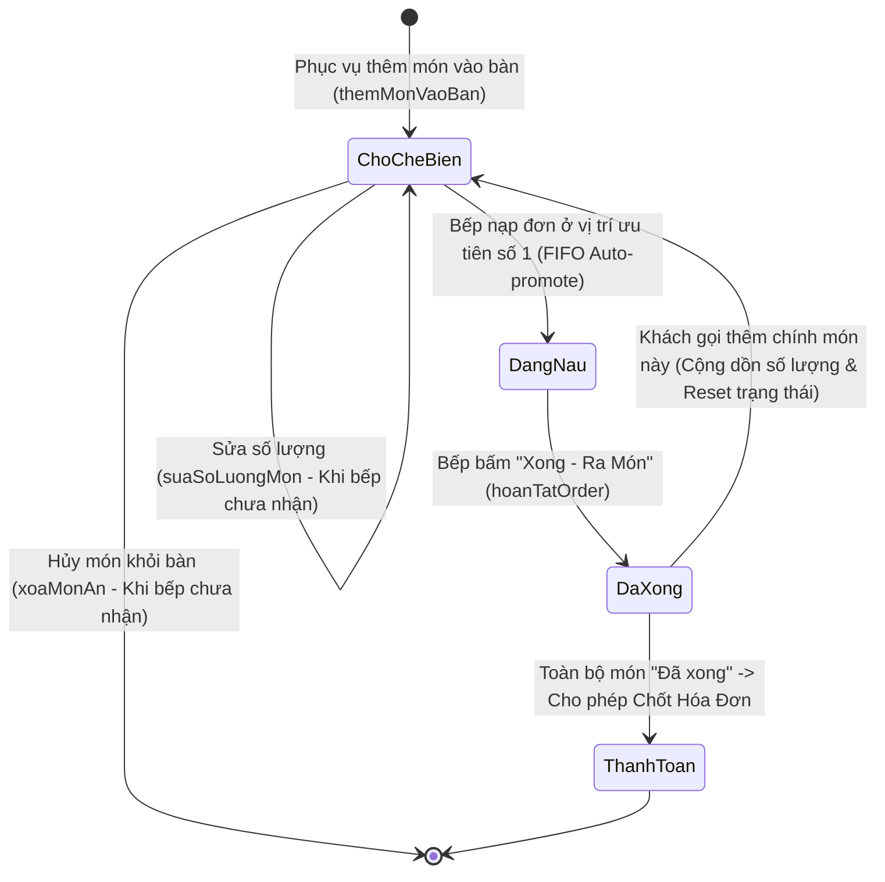
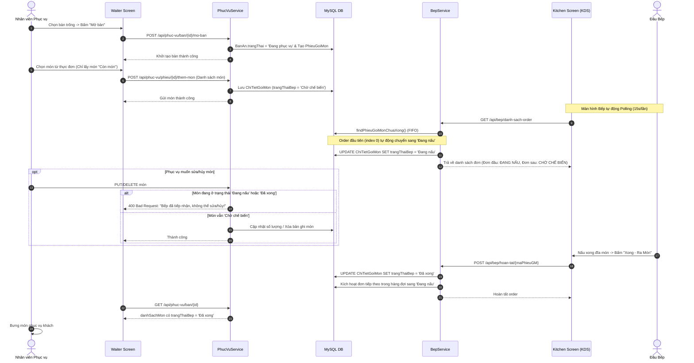
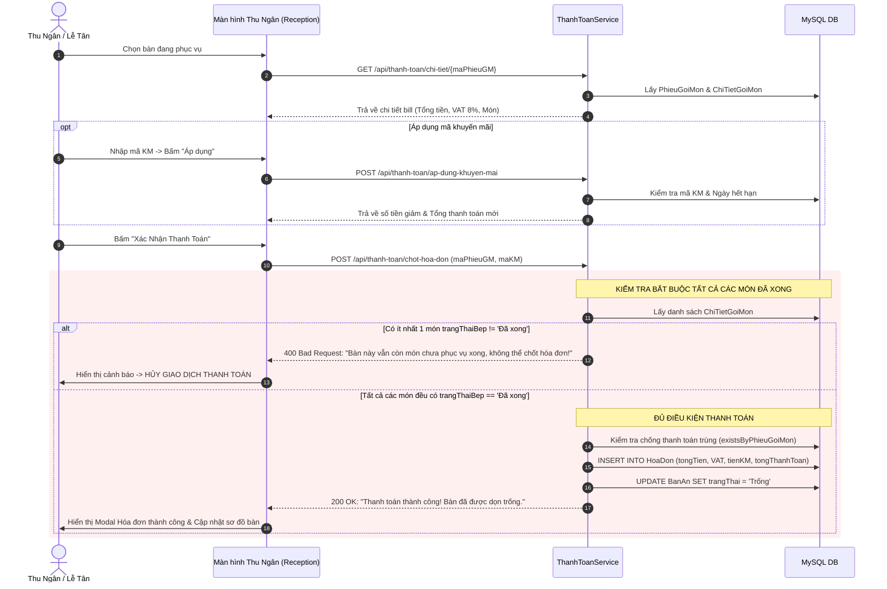

# BÁO CÁO PHÂN TÍCH VÀ ĐẶC TẢ CÁC LUỒNG NGHIỆP VỤ HỆ THỐNG
## HỆ THỐNG QUẢN LÝ NHÀ HÀNG (RESTAURANT MANAGEMENT SYSTEM)

---

## MỤC LỤC
1. [TỔNG QUAN HỆ THỐNG & KIẾN TRÚC NGHIỆP VỤ](#1-tổng-quan-hệ-thống--kiến-trúc-nghiệp-vụ)
2. [NGHIỆP VỤ 1: ĐẶT BÀN & QUẢN TRỊ TRẠNG THÁI BÀN (RESERVATION WORKFLOW)](#2-nghiệp-vụ-1-đặt-bàn--quản-trị-trạng-thái-bàn-reservation-workflow)
   - 2.1. Mục tiêu và phạm vi nghiệp vụ
   - 2.2. Cấu trúc dữ liệu & Thực thể liên quan
   - 2.3. Quy tắc nghiệp vụ cốt lõi (Business Rules)
   - 2.4. Cơ chế khóa bàn thông minh 2 lớp (Smart Table-Locking Mechanism)
   - 2.5. Cơ chế tự động giải phóng bàn quá hạn (Auto-Release / No-Show Handling)
   - 2.6. Quy trình phối hợp giữa Lễ tân và Phục vụ (Receptionist - Waiter Collaboration)
   - 2.7. Sơ đồ tuần tự nghiệp vụ Đặt bàn (Sequence Diagram)
3. [NGHIỆP VỤ 2: GỌI MÓN & ĐỒNG BỘ PHỤC VỤ - BẾP (ORDERING & KITCHEN SYNC WORKFLOW)](#3-nghiệp-vụ-2-gọi-món--đồng-bộ-phục-vụ---bếp-ordering--kitchen-sync-workflow)
   - 3.1. Mục tiêu và phạm vi nghiệp vụ
   - 3.2. Cấu trúc dữ liệu & Thực thể liên quan
   - 3.3. Quy tắc mở bàn và kiểm soát danh mục món ăn khả dụng
   - 3.4. Nghiệp vụ thêm món, gọi thêm (Upselling) & Cập nhật trạng thái chế biến
   - 3.5. Ràng buộc bảo vệ đơn hàng (Strict Kitchen Lock Constraints)
   - 3.6. Cơ chế hàng đợi chế biến tại Bếp (Kitchen KDS - FIFO Queue)
   - 3.7. Nghiệp vụ hoàn tất món và chuyển giao trạng thái
   - 3.8. Vòng đời và sơ đồ trạng thái món ăn (Dish State Machine)
   - 3.9. Sơ đồ tuần tự luồng Gọi món & Bếp (Sequence Diagram)
4. [NGHIỆP VỤ 3: THANH TOÁN & RÀNG BUỘC HOÀN TẤT CHẾ BIẾN (PAYMENT & CHECKOUT WORKFLOW)](#4-nghiệp-vụ-3-thanh-toán--ràng-buộc-hoàn-tất-chế-biến-payment--checkout-workflow)
   - 4.1. Mục tiêu và phạm vi nghiệp vụ
   - 4.2. Cấu trúc dữ liệu & Thực thể liên quan
   - 4.3. Ràng buộc sống còn: Kiểm tra chế biến xong toàn bộ món ăn (Kitchen Fulfillment Validation)
   - 4.4. Quy trình tính toán hóa đơn, thuế VAT & Khấu trừ khuyến mãi
   - 4.5. Cơ chế chống thanh toán trùng lặp (Anti-Double Billing)
   - 4.6. Cơ chế tự động hoàn tất & Giải phóng bàn ăn (Table Auto-Reset)
   - 4.7. Sơ đồ tuần tự nghiệp vụ Thanh toán (Sequence Diagram)
5. [BẢNG TỔNG HỢP API & MA TRẬN PHÂN QUYỀN VAI TRÒ](#5-bảng-tổng-hợp-api--ma-trận-phân-quyền-vai-trò)
6. [KẾT LUẬN & ĐÁNH GIÁ ĐỘ ỔN ĐỊNH CỦA HỆ THỐNG](#6-kết-luận--đánh-giá-độ-ổn-định-của-hệ-thống)

---

## 1. TỔNG QUAN HỆ THỐNG & KIẾN TRÚC NGHIỆP VỤ

Hệ thống Quản lý Nhà hàng được xây dựng theo mô hình Client-Server phân tầng hiện đại:
- **Backend**: Spring Boot 3.x, Spring Data JPA, Hibernate, cơ chế lập lịch `@Scheduled`, cơ sở dữ liệu quan hệ MySQL.
- **Frontend**: Single Page Application (SPA) phát triển bằng ReactJS, Vite, TailwindCSS, Axios API Client.
- **Giao thức giao tiếp**: RESTful API kết hợp Polling định kỳ (Near Real-time) và Background Cron Jobs.

Hệ thống được thiết kế xoay quanh 3 mắt xích vận hành sống còn trong nhà hàng:
1. **Lễ tân (Receptionist)**: Tiếp nhận đặt bàn, xếp chỗ, quản lý luồng khách đặt trước và thanh toán hóa đơn.
2. **Nhân viên Phục vụ (Waiter)**: Tiếp nhận bàn tại sảnh, ghi nhận order, chỉnh sửa món theo yêu cầu thực khách, theo dõi trạng thái chế biến.
3. **Bộ phận Bếp (Kitchen / KDS)**: Tiếp nhận đơn món theo thứ tự ưu tiên (FIFO), chế biến, cập nhật tình trạng nguyên liệu thực đơn.

---

## 2. NGHIỆP VỤ 1: ĐẶT BÀN & QUẢN TRỊ TRẠNG THÁI BÀN (RESERVATION WORKFLOW)

### 2.1. Mục tiêu và phạm vi nghiệp vụ
Nghiệp vụ Đặt bàn đảm bảo khách hàng có thể đặt trước vị trí bàn ăn với số lượng khách và khung giờ cụ thể. Hệ thống giải quyết triệt để các bài toán thực tế:
- **Ngăn chặn đặt trùng bàn (Anti-Conflict)**: Không cho phép 2 khách hàng đặt cùng một bàn trong các khung thời gian sát nhau.
- **Tối ưu công suất bàn (Table Utilization Optimization)**: Không khóa bàn quá sớm đối với các lịch đặt trước nhiều ngày hoặc nhiều giờ, giúp bàn vẫn có thể đón khách vãng lai bình thường.
- **Bảo vệ chỗ ngồi khi sắp đến giờ hẹn (Smart Locking)**: Tự động khóa bàn khi đến khung giờ cận kề lịch hẹn để phục vụ không xếp nhầm khách khác vào.
- **Thu hồi bàn khi khách trễ hẹn (No-Show Handling)**: Tự động hủy phiếu và giải phóng bàn nếu khách không đến sau 45 phút kể từ giờ hẹn.

### 2.2. Cấu trúc dữ liệu & Thực thể liên quan

```
+------------------+         1..* +-------------------+         1..* +-------------------+
|    KhachHang     | <----------- |    PhieuDatBan    | -----------> |       BanAn       |
+------------------+              +-------------------+              +-------------------+
| soDienThoai (PK) |              | maPhieuDB (PK)    |              | maBan (PK)        |
| hoTen            |              | ngayGioDat        |              | tenBan            |
+------------------+              | soNguoiLon        |              | soCho             |
                                  | soTreEm           |              | trangThai         |
                                  | yeuCau            |              +-------------------+
                                  | trangThai         |
                                  +-------------------+
```

- **`KhachHang`**: Lưu thông tin khách hàng. Hệ thống tự động định danh khách qua số điện thoại:
  - Nếu số điện thoại đã tồn tại: Cập nhật họ tên mới nhất.
  - Nếu chưa có: Tự động khởi tạo bản ghi khách hàng mới (`PhieuDatBanServiceImpl.xuLyKhachHang`).
- **`BanAn`**: Lưu trạng thái bàn ăn, gồm 3 giá trị chuẩn hóa:
  - `"Trống"`: Bàn sẵn sàng đón khách.
  - `"Đã đặt"`: Bàn đang được giữ chỗ cho một phiếu đặt bàn sắp diễn ra.
  - `"Đang phục vụ"`: Bàn đang có khách ngồi ăn và đang có phiếu gọi món hoạt động.
- **`PhieuDatBan`**: Đại diện cho một lịch hẹn đặt bàn. Cột `trangThai` gồm 3 giá trị:
  - `"Đã đặt"`: Phiếu đang có hiệu lực và chờ khách đến nhận bàn.
  - `"Đã đến quán"`: Khách đã có mặt và được tiếp nhận vào bàn.
  - `"Đã hủy"`: Phiếu bị hủy do khách báo hủy hoặc hệ thống tự động hủy do quá hạn.

### 2.3. Quy tắc nghiệp vụ cốt lõi (Business Rules)

#### Quy tắc 1: Kiểm tra xung đột thời gian (Conflict Window ± 2 Giờ)
Khi tạo mới hoặc cập nhật một phiếu đặt bàn vào thời điểm $T_{\text{mới}}$, hệ thống thực hiện kiểm tra trong cơ sở dữ liệu:
- Khoảng kiểm tra: $[T_{\text{mới}} - 2 \text{ giờ}, T_{\text{mới}} + 2 \text{ giờ}]$.
- Điều kiện xung đột: Tồn tại ít nhất một phiếu đặt bàn khác trên cùng bàn đó có trạng thái `"Đã đặt"` nằm trong khoảng thời gian trên.
- **Thực thi trong mã nguồn**:
  - `PhieuDatBanRepository.findConflicts(maBan, start, end)`
  - Nếu có xung đột, hệ thống lập tức ném lỗi:
    ```
    "Bàn {maBan} đã có khách đặt vào lúc {gioDat}. Vui lòng chọn giờ khác hoặc bàn khác!"
    ```

#### Quy tắc 2: Tự động đồng bộ khi cập nhật hoặc đổi bàn
Khi chỉnh sửa phiếu đặt bàn:
- Nếu khách đổi sang bàn mới: Bàn cũ sẽ được hoàn trả về trạng thái `"Trống"` ngay lập tức (`banCu.setTrangThai("Trống")`).
- Bàn mới sẽ được kiểm tra xung đột thời gian độc lập trước khi chấp thuận cập nhật.

### 2.4. Cơ chế khóa bàn thông minh 2 lớp (Smart Table-Locking Mechanism)

Để giải quyết bài toán: **Khách đặt trước 1 ngày hoặc 5 tiếng thì không thể khóa bàn ngay lúc tạo phiếu**, hệ thống áp dụng cơ chế khóa bàn 2 lớp:

```
Thời điểm hiện tại (NOW) ---------------------> Lịch đặt bàn (T_dat)
                                               |
Khung kiểm tra khóa: [NOW - 45 phút  =======>  NOW + 2 giờ]
                                               |
Nếu T_dat nằm trong khung này:
  -> Bàn đổi sang "Đã đặt" (Khóa bàn)
Nếu T_dat xa hơn 2 giờ:
  -> Bàn vẫn giữ "Trống" (Phục vụ khách vãng lai bình thường)
```

1. **Lớp 1: Khóa bàn tức thì (Immediate Fast-Lock)**:
   - Áp dụng ngay khi Lễ tân bấm Lưu phiếu (`taoPhieuDatBan` hoặc `capNhatPhieu`).
   - Kiểm tra điều kiện:
     $$T_{\text{mới}} > (\text{now} - 45\text{ phút}) \quad \text{VÀ} \quad T_{\text{mới}} < (\text{now} + 2\text{ giờ})$$
   - Nếu thỏa mãn và bàn đang `"Trống"`, hệ thống chuyển `BanAn.trangThai = "Đã đặt"` ngay trong transaction tạo phiếu.
2. **Lớp 2: Tiến trình quét tự động theo chu kỳ (Cron-Job Auto-Lock)**:
   - Sử dụng Spring Scheduling: `@Scheduled(fixedRate = 300000)` (chạy ngầm mỗi 5 phút).
   - Phương thức: `PhieuDatBanServiceImpl.autoLockUpcomingReservations()`.
   - Tìm kiếm các phiếu có:
     $$\text{now} \le T_{\text{dat}} \le (\text{now} + 2\text{ giờ}) \quad \text{và} \quad \text{BanAn.trangThai} = \text{'Trống'} \quad \text{và} \quad \text{Phieu.trangThai} = \text{'Đã đặt'}$$
   - Tự động khóa bàn: Chuyển `BanAn.trangThai = "Đã đặt"` khi lịch hẹn bước vào vùng đệm 2 giờ trước giờ đón khách.

### 2.5. Cơ chế tự động giải phóng bàn quá hạn (Auto-Release / No-Show Handling)

Trong vận hành nhà hàng, nếu khách đặt bàn nhưng không đến (No-Show) mà bàn vẫn bị khóa `"Đã đặt"` thì nhà hàng sẽ chịu thiệt hại doanh thu:
- Tiến trình quét ngầm: `@Scheduled(fixedRate = 300000)` (5 phút/lần).
- Phương thức: `PhieuDatBanServiceImpl.autoReleaseExpiredReservations()`.
- Tiêu chí quét:
  $$T_{\text{dat}} \le (\text{now} - 45\text{ phút}) \quad \text{và} \quad \text{BanAn.trangThai} = \text{'Đã đặt'} \quad \text{và} \quad \text{Phieu.trangThai} = \text{'Đã đặt'}$$
- Hành động xử lý:
  1. Đổi `BanAn.trangThai = "Trống"`.
  2. Tự động xóa/hủy phiếu đặt bàn quá hạn (`phieuDatBanRepository.delete(phieu)`).
  3. Ghi log hệ thống để theo dõi. Bàn lập tức hiển thị màu xanh ("Trống") trên sơ đồ bàn để phục vụ có thể xếp khách vãng lai.

### 2.6. Quy trình phối hợp giữa Lễ tân và Phục vụ (Receptionist - Waiter Collaboration)

Hệ thống thiết lập sự phân tách vai trò nhưng đảm bảo đồng bộ trạng thái chặt chẽ:

#### Tại Giao diện Lễ tân (`Reception.jsx`):
- Tab Quản lý đặt bàn chỉ hiển thị các phiếu đang chờ với trạng thái `"Đã đặt"` (`findAllByTrangThaiOrderByNgayGioDatAsc("Đã đặt")`).
- **Nút "Đã đến nhận bàn"**:
  - Gọi API: `PUT /api/phieu-dat-ban/{id}/da-den`.
  - Phiếu chuyển `trangThai = "Đã đến quán"`.
  - Phiếu tự động biến mất khỏi danh sách chờ của Lễ tân để tránh giao diện bị quá tải.
- **Nút "Hủy phiếu"**:
  - Gọi API: `DELETE /api/phieu-dat-ban/{id}`.
  - Phiếu chuyển `trangThai = "Đã hủy"`.
  - Nếu bàn ăn đang bị khóa bởi phiếu này, hệ thống tự động hoàn trả `BanAn.trangThai = "Trống"`.

#### Tại Giao diện Nhân viên Phục vụ (`Waiter.jsx`):
- Bàn đã đặt hiển thị trực quan dạng thẻ màu đỏ/cam kèm mã hiển thị `#RES-...` lấy từ API `/api/phuc-vu/ban`.
- Khi phục vụ bấm chọn bàn đã đặt để xem chi tiết: API `/api/phuc-vu/ban/{maBan}` trả về tên khách đặt bàn (`tenKhachDatBan`) và thời gian đặt (`thoiGianDatBan`).
- **Lớp bảo vệ xác nhận an toàn (Confirmation Guard)**:
  - Khi Phục vụ bấm nút **"Mở bàn"** trên bàn đang `"Đã đặt"`:
  - Giao diện kích hoạt hộp thoại xác nhận:
    ```
    Bàn này đang được giữ cho:
    - Khách hàng: [Tên khách đặt]
    - Thời gian đặt: [Giờ hẹn]

    Xác nhận đúng khách đặt đã đến và tiến hành Mở bàn?
    ```
  - Nếu Phục vụ bấm **Cancel**: Hệ thống hủy thao tác, giữ nguyên trạng thái khóa bàn.
  - Nếu Phục vụ bấm **OK**: Hệ thống gọi API `POST /api/phuc-vu/ban/{id}/mo-ban`, chuyển trạng thái bàn sang `"Đang phục vụ"` và khởi tạo phiếu order mới.

### 2.7. Sơ đồ tuần tự nghiệp vụ Đặt bàn (Sequence Diagram)



---

## 3. NGHIỆP VỤ 2: GỌI MÓN & ĐỒNG BỘ PHỤC VỤ - BẾP (ORDERING & KITCHEN SYNC WORKFLOW)

### 3.1. Mục tiêu và phạm vi nghiệp vụ
Nghiệp vụ Gọi món thiết lập luồng trao đổi thông tin liên tục, chính xác giữa bộ phận bàn (Phục vụ) và bộ phận chế biến (Bếp). Hệ thống giải quyết các vấn đề:
- Tự động hóa truyền order từ sảnh vào màn hình hiển thị tại bếp (KDS - Kitchen Display System).
- Xử lý hàng đợi nấu nướng theo nguyên tắc công bằng FIFO (First In, First Out).
- Kiểm soát chặt chẽ việc sửa đổi hoặc hủy món ăn khi bếp đã bắt đầu chế biến.
- Cập nhật tình trạng nguyên liệu/thực đơn theo thời gian thực để ngăn việc gọi phải món đã hết.

### 3.2. Cấu trúc dữ liệu & Thực thể liên quan

```
+--------------------+ 1      1..* +--------------------+ *      1 +--------------------+
|    PhieuGoiMon     | <---------- |   ChiTietGoiMon    | ----------> |       MonAn        |
+--------------------+             +--------------------+             +--------------------+
| maPhieuGM (PK)     |             | maPhieuGM (PK, FK) |             | maMon (PK)         |
| thoiGianLap        |             | maMon (PK, FK)     |             | tenMon             |
| thoiGianSua        |             | soLuong            |             | donGia             |
| ghiChuKhachHang    |             | donGia             |             | trangThai          |
| banAn (FK)         |             | trangThaiBep       |             | loaiMon            |
| nhanVien (FK)      |             +--------------------+             +--------------------+
+--------------------+
```

- **`PhieuGoiMon`**: Đại diện cho phiên ăn của bàn. Được tạo tự động khi bàn được mở (`moBan`).
- **`ChiTietGoiMon`**: Khóa chính phức hợp (`ChiTietGoiMonId` gồm `maPhieuGM` và `maMon`).
  - `donGia`: Lưu đơn giá tại thời điểm gọi món (đảm bảo không bị ảnh hưởng nếu giá niêm yết trong danh mục sau này thay đổi).
  - `trangThaiBep`: Trạng thái chế biến của từng món trong order, gồm:
    - `"Chờ chế biến"`: Món mới được phục vụ gửi vào, đang nằm trong hàng đợi.
    - `"Đang nấu"`: Món đã được chuyển sang chế biến chính thức tại trạm bếp.
    - `"Đã xong"`: Bếp đã nấu xong, sẵn sàng bưng ra bàn cho thực khách.
- **`MonAn`**: Thực đơn nhà hàng. Trường `trangThai` gồm `"Còn món"` hoặc `"Hết món"`.

### 3.3. Quy tắc mở bàn và kiểm soát danh mục món ăn khả dụng

1. **Mở bàn (`PhucVuServiceImpl.moBan`)**:
   - Nhân viên phục vụ chọn bàn "Trống" hoặc "Đã đặt" (sau khi xác nhận popup) để mở bàn.
   - Hệ thống kiểm tra: Nếu bàn đang có `trangThai == "Đang phục vụ"` thì chặn: `"Bàn này đang được phục vụ rồi!"`.
   - Cập nhật trạng thái bàn sang `"Đang phục vụ"`.
   - Tạo bản ghi `PhieuGoiMon` mới toanh gán mã nhân viên mở bàn, lưu vết thời gian mở bàn `LocalDateTime.now()`.
2. **Kiểm soát thực đơn khả dụng (`PhucVuServiceImpl.layThucDon`)**:
   - Khi phục vụ mở modal gọi món: Backend truy vấn `monAnRepository.findByTrangThai("Còn món")`.
   - **Quy tắc**: Các món đã bị Bếp tắt công tắc (trạng thái `"Hết món"`) sẽ **hoàn toàn không xuất hiện** trên màn hình gọi món của phục vụ, triệt tiêu tình trạng nhận order món khách thích nhưng bếp không có nguyên liệu.

### 3.4. Nghiệp vụ thêm món, gọi thêm (Upselling) & Cập nhật trạng thái chế biến

Khi phục vụ gửi danh sách món vào bàn (`POST /api/phuc-vu/phieu/{maPhieuGM}/them-mon`):
Hệ thống duyệt từng món trong danh sách yêu cầu (`ThemMonRequest.MonDuocChon`):
- **Trường hợp 1: Món mới chưa có trong order**:
  - Khởi tạo bản ghi `ChiTietGoiMon` mới.
  - Gán `soLuong = monReq.getSoLuong()`.
  - Chốt `donGia = monAn.getDonGia()`.
  - Gán cứng `trangThaiBep = "Chờ chế biến"`.
- **Trường hợp 2: Món đã có trong order (Khách gọi thêm)**:
  - Hệ thống cộng dồn số lượng: `ct.setSoLuong(ct.getSoLuong() + monReq.getSoLuong())`.
  - **Kỹ thuật nghiệp vụ thực tế đặc biệt**:
    ```java
    // Bật ngược trạng thái lại thành "Chờ chế biến" để Bếp biết mà nấu thêm phần mới này
    ct.setTrangThaiBep("Chờ chế biến");
    ```
    *Ý nghĩa*: Nếu món này trước đó Bếp đã nấu xong (`"Đã xong"`), nhưng khách ăn ngon miệng gọi thêm 1 đĩa nữa, hệ thống tự động đưa món quay lại trạng thái `"Chờ chế biến"`. Nhờ vậy, order này lập tức xuất hiện trở lại trên màn hình KDS của bếp và chuyển sang trạng thái chờ thanh toán để tránh việc phục vụ bưng thiếu hoặc thanh toán trước khi phần gọi thêm hoàn tất.

### 3.5. Ràng buộc bảo vệ đơn hàng (Strict Kitchen Lock Constraints)

Để tránh việc xung đột dữ liệu giữa sảnh và bếp (ví dụ: phục vụ xóa món trong khi bếp đang chiên xào hoặc đã bày đĩa), hệ thống thiết lập cơ chế khóa cứng tại Service:

#### Ràng buộc 1: Sửa số lượng món (`PhucVuServiceImpl.suaSoLuongMon`)
- Endpoint: `PUT /api/phuc-vu/phieu/{maPhieuGM}/mon/{maMon}` với payload `soLuongMoi`.
- Kiểm tra điều kiện:
  ```java
  if (!"Chờ chế biến".equals(ct.getTrangThaiBep())) {
      throw new IllegalArgumentException("Bếp đã tiếp nhận món này, không thể sửa số lượng!");
  }
  ```
- **Hệ quả**: Phục vụ chỉ có thể tăng/giảm số lượng khi món còn ở trạng thái `"Chờ chế biến"`. Khi món đã được bếp tiếp nhận sang `"Đang nấu"` hoặc `"Đã xong"`, giao diện phục vụ vô hiệu hóa hoặc chặn chỉnh sửa.

#### Ràng buộc 2: Hủy món khỏi bàn (`PhucVuServiceImpl.xoaMonAn`)
- Endpoint: `DELETE /api/phuc-vu/phieu/{maPhieuGM}/mon/{maMon}`.
- Kiểm tra điều kiện:
  ```java
  if (!"Chờ chế biến".equals(ct.getTrangThaiBep())) {
      throw new IllegalArgumentException("Bếp đang nấu hoặc đã ra món, không thể hủy!");
  }
  ```
- **Hệ quả**: Chặn tuyệt đối việc thất thoát chi phí nguyên liệu của nhà hàng. Nếu bếp đã bắt đầu nấu thì phục vụ không được tự ý hủy món trên hệ thống.

### 3.6. Cơ chế hàng đợi chế biến tại Bếp (Kitchen KDS - FIFO Queue)

Màn hình Bếp (`Kitchen.jsx`) hoạt động như một hệ thống KDS số hóa, đồng bộ với backend thông qua cơ chế Polling tự động mỗi 15 giây (`setInterval(fetchOrders, 15000)`) hoặc bấm nút "Đồng bộ":

```
[Hàng đợi Order chưa hoàn thành] -> Sắp xếp theo Thời gian lập ASC (FIFO)
  │
  ├── Order đầu tiên (Index 0):
  │     Trạng thái: "ĐANG NẤU" (Thẻ viền xanh dương)
  │     Backend: Tự động chuyển các món "Chờ chế biến" -> "Đang nấu"
  │     Nút thao tác: [Xong - Ra Món]
  │
  ├── Order tiếp theo (Index 1):
  │     Trạng thái: "CHỜ CHẾ BIẾN"
  │     Vị trí chờ: "Đang đợi #1"
  │
  └── Order tiếp theo (Index 2):
        Trạng thái: "CHỜ CHẾ BIẾN"
        Vị trí chờ: "Đang đợi #2"
```

- **Truy vấn cơ sở dữ liệu (`PhieuGoiMonRepository.findPhieuGoiMonChuaXong`)**:
  ```sql
  SELECT DISTINCT p FROM PhieuGoiMon p 
  JOIN ChiTietGoiMon c ON p.maPhieuGM = c.phieuGoiMon.maPhieuGM 
  WHERE c.trangThaiBep <> 'Đã xong' 
  ORDER BY p.thoiGianLap ASC
  ```
  Query này đảm bảo đơn nào vào trước sẽ được xếp lên đầu tiên (nguyên tắc FIFO).
- **Cơ chế tự kích hoạt trạng thái "Đang nấu" (`BepServiceImpl.layDanhSachOrder`)**:
  - Khi Backend nạp danh sách order, order đứng ở vị trí `index == 0` được chỉ định là đơn ưu tiên đang xử lý.
  - Backend tự động quét các chi tiết món ăn trong order này: Món nào đang có trạng thái `"Chờ chế biến"` sẽ được cập nhật đồng loạt thành `"Đang nấu"` và lưu vào CSDL (`chiTietGoiMonRepository.saveAll`).
  - Nhân viên phục vụ khi xem chi tiết bàn sẽ nhìn thấy nhãn trạng thái món chuyển sang màu vàng `"Đang nấu"`.

### 3.7. Nghiệp vụ hoàn tất món và chuyển giao trạng thái

Khi đầu bếp chuẩn bị xong tất cả món ăn trong order hiện tại, bấm nút **"Xong - Ra Món"**:
- Gọi API: `POST /api/bep/hoan-tat/{maPhieuGM}`.
- Xử lý nghiệp vụ tại `BepServiceImpl.hoanTatOrder`:
  1. Toàn bộ món ăn trong order hiện tại được cập nhật `trangThaiBep = "Đã xong"`.
  2. Order này không còn thỏa mãn điều kiện `findPhieuGoiMonChuaXong` và sẽ biến mất khỏi danh sách order đang chờ của bếp.
  3. **Tự động kích hoạt order kế tiếp**: Hệ thống tự động tìm đơn hàng tiếp theo trong hàng đợi (nếu có), chuyển toàn bộ các món `"Chờ chế biến"` của đơn tiếp theo sang `"Đang nấu"`.
  4. Phục vụ trên màn hình sảnh thấy nhãn món chuyển sang màu xanh `"Đã xong"` và tiến hành bưng món phục vụ khách.

### 3.8. Vòng đời và sơ đồ trạng thái món ăn (Dish State Machine)



### 3.9. Sơ đồ tuần tự luồng Gọi món & Bếp (Sequence Diagram)



---

## 4. NGHIỆP VỤ 3: THANH TOÁN & RÀNG BUỘC HOÀN TẤT CHẾ BIẾN (PAYMENT & CHECKOUT WORKFLOW)

### 4.1. Mục tiêu và phạm vi nghiệp vụ
Nghiệp vụ Thanh toán là giai đoạn kết thúc một lượt phục vụ bàn. Quy trình này đòi hỏi tính chính xác tuyệt đối về số liệu tài chính, quản lý thất thoát và đảm bảo trải nghiệm khách hàng:
- Chốt doanh thu thực tế bao gồm tiền món, thuế giá trị gia tăng (VAT) và các chương trình khuyến mãi.
- **Ràng buộc nghiệp vụ tiên quyết**: **Kiểm tra bàn ăn đã được phục vụ xong toàn bộ các món hay chưa** trước khi cho phép in hóa đơn và thu tiền.
- Tự động dọn bàn, chuyển trạng thái bàn ăn về `"Trống"` để sẵn sàng đón lượt khách tiếp theo.

### 4.2. Cấu trúc dữ liệu & Thực thể liên quan

```
+--------------------+ 1      1 +--------------------+ *      0..1 +--------------------+
|    PhieuGoiMon     | <------- |       HoaDon       | ----------> |     KhuyenMai      |
+--------------------+          +--------------------+             +--------------------+
| maPhieuGM (PK)     |          | maHD (PK)          |             | maKM (PK)          |
| banAn (FK)         |          | ngayGio            |             | tenKM              |
+--------------------+          | tongTien           |             | tienGiam           |
                                | thueVAT            |             | ngayBatDau         |
                                | tienKhuyenMai      |             | ngayKetThuc        |
                                | tongThanhToan      |             +--------------------+
                                +--------------------+
```

- **`HoaDon`**: Bản ghi thanh toán tài chính chính thức:
  - Quan hệ 1-1 với `PhieuGoiMon` (`@OneToOne`).
  - `tongTien`: Tổng tiền các món ăn trước thuế và ưu đãi.
  - `thueVAT`: Thuế giá trị gia tăng (mặc định cấu hình 8% của `tongTien`).
  - `tienKhuyenMai`: Số tiền chiết khấu được trừ trực tiếp từ mã khuyến mãi.
  - `tongThanhToan`: Số tiền thực thu cuối cùng = $\max(0, \text{tongTien} + \text{thueVAT} - \text{tienKhuyenMai})$.
- **`KhuyenMai`**: Chương trình ưu đãi giảm giá cố định.
  - Ràng buộc ngày hết hạn: `ngayKetThuc.isBefore(LocalDate.now())`.

### 4.3. Ràng buộc sống còn: Kiểm tra chế biến xong toàn bộ món ăn (Kitchen Fulfillment Validation)

Đây là nghiệp vụ cốt lõi ngăn ngừa các sự cố nghiêm trọng trong vận hành nhà hàng:

#### Vấn đề thực tế nếu thiếu ràng buộc này:
1. **Thu tiền nhưng không ra món**: Thu ngân chốt bill cho khách về, nhưng trong bếp đầu bếp vẫn tiếp tục nấu vì không biết khách đã về. Dẫn đến lãng phí nguyên liệu và đồ ăn bị đổ bỏ.
2. **Khách phàn nàn & Tranh chấp**: Khách bị thu tiền món mà bàn của họ chưa bao giờ được phục vụ, dẫn đến khiếu nại làm tổn hại uy tín thương hiệu.
3. **Thất thoát & Sai lệch kế toán**: Thu ngân và phục vụ có thể thông đồng chốt bill sớm để gian lận các món ăn chưa hoàn thành.

#### Cơ chế triển khai chi tiết tại Backend (`ThanhToanServiceImpl.java:164-170`):
Khi API `POST /api/thanh-toan/chot-hoa-don` được gọi, trước khi thực hiện bất kỳ phép tính tài chính nào, hệ thống thực hiện vòng lặp kiểm tra toàn bộ chi tiết món trong phiếu:

```java
List<ChiTietGoiMon> chiTietGoiMons = chiTietGoiMonRepository.findByPhieuGoiMon_MaPhieuGM(phieu.getMaPhieuGM());

// KIỂM TRA CHẶN THANH TOÁN NẾU BẾP CHƯA LÀM XONG MÓN
for (ChiTietGoiMon ct : chiTietGoiMons) {
    if (!"Đã xong".equals(ct.getTrangThaiBep())) {
        throw new IllegalArgumentException("Bàn này vẫn còn món chưa phục vụ xong, không thể chốt hóa đơn!");
    }
}
```

#### Quy tắc kiểm tra logic:
- Nếu tồn tại **dù chỉ 1 món** đang có `trangThaiBep` là `"Chờ chế biến"` hoặc `"Đang nấu"`, phương thức lập tức ném ngoại lệ `IllegalArgumentException`.
- Toàn bộ transaction bị `Rollback`, không có bản ghi `HoaDon` nào được lưu, trạng thái bàn ăn không bị thay đổi.

#### Phản hồi tại Giao diện Frontend (`Reception.jsx:266-286`):
- Khi Thu ngân bấm nút **"Xác Nhận Thanh Toán"**, axios client gửi request đến server.
- Khối `catch (e)` bắt lỗi nghiệp vụ từ backend và cảnh báo trực tiếp bằng popup:
  ```javascript
  alert('Lỗi thanh toán: Bàn này vẫn còn món chưa phục vụ xong, không thể chốt hóa đơn!');
  ```
- **Hướng xử lý bắt buộc cho nhân viên**:
  - *Nếu khách vẫn muốn ăn*: Thu ngân thông báo phục vụ giục bếp nấu nhanh. Khi bếp hoàn thành và bấm "Xong - Ra Món" trên KDS, bàn mới đủ điều kiện thanh toán.
  - *Nếu khách không muốn chờ nữa và yêu cầu bỏ món*: Phục vụ phải thực hiện thao tác **Hủy món** đó khỏi bàn trên màn hình Waiter (chỉ hủy được khi món còn ở trạng thái "Chờ chế biến"). Sau khi món chưa hoàn thành được loại bỏ khỏi đơn, Thu ngân mới có thể tiến hành chốt hóa đơn.

### 4.4. Quy trình tính toán hóa đơn, thuế VAT & Khấu trừ khuyến mãi

Quy trình thanh toán được thực hiện qua 3 bước chặt chẽ:

#### Bước 1: Xem trước chi tiết thanh toán (`ThanhToanServiceImpl.layChiTietThanhToan`)
- Thu ngân chọn bàn từ danh sách đang phục vụ (`GET /api/thanh-toan/ban-dang-phuc-vu`).
- Backend trả về danh sách chi tiết các món ăn, đơn giá lúc gọi và thành tiền:
  $$\text{thanhTien}_i = \text{soLuong}_i \times \text{donGia}_i$$
  $$\text{tongTienMon} = \sum_{i=1}^{n} \text{thanhTien}_i$$
  $$\text{thueVAT} = \text{tongTienMon} \times 0.08 \quad (8\%)$$
  $$\text{tongThanhToan} = \text{tongTienMon} + \text{thueVAT}$$

#### Bước 2: Áp dụng mã ưu đãi (`ThanhToanServiceImpl.apDungKhuyenMai`)
- Thu ngân nhập mã khuyến mãi (ví dụ: `SUMMER2026`) -> Gọi `POST /api/thanh-toan/ap-dung-khuyen-mai`.
- Backend kiểm tra tính hợp lệ:
  - Tồn tại trong CSDL.
  - Kiểm tra ngày hết hạn: `km.getNgayKetThuc().isBefore(LocalDate.now())`. Nếu đã quá hạn -> Bắn lỗi: `"Mã khuyến mãi đã hết hạn!"`.
- Tính lại tổng thanh toán:
  $$\text{tongThanhToan} = \max(0, \text{tongTienMon} + \text{thueVAT} - \text{tienKhuyenMai})$$

#### Bước 3: Chốt hóa đơn chính thức (`ThanhToanServiceImpl.chotHoaDon`)
- Kiểm tra tính toàn vẹn món (mục 4.3).
- Lưu bản ghi `HoaDon` gắn mã khuyến mãi áp dụng và thời gian thanh toán `LocalDateTime.now()`.

### 4.5. Cơ chế chống thanh toán trùng lặp (Anti-Double Billing)

Để phòng tránh lỗi nhấp đúp (double-click) hoặc gửi đồng thời nhiều yêu cầu thanh toán cho cùng một bàn:
- Backend thực hiện kiểm tra kiểm tra bản ghi hóa đơn:
  ```java
  if (hoaDonRepository.existsByPhieuGoiMon_MaPhieuGM(phieu.getMaPhieuGM())) {
      throw new IllegalArgumentException("Phiếu order này đã được xuất hóa đơn rồi!");
  }
  ```
- Nếu phiếu order đã được tạo hóa đơn, giao dịch lần 2 sẽ bị từ chối ngay lập tức, ngăn ngừa sai lệch doanh thu sổ sách.

### 4.6. Cơ chế tự động hoàn tất & Giải phóng bàn ăn (Table Auto-Reset)

Sau khi lưu hóa đơn thành công trong cùng một transaction:
1. **Giải phóng bàn ăn**:
   ```java
   BanAn ban = phieu.getBanAn();
   ban.setTrangThai("Trống");
   banAnRepository.save(ban);
   ```
2. **Hiển thị thông báo hoàn tất & Hóa đơn điện tử**:
   - Frontend hiển thị modal thành công (`isSuccessModalOpen = true`) với mã hóa đơn giả lập dạng `INV-ORD-...`, hiển thị phương thức thanh toán đã chọn (Tiền mặt, Chuyển khoản QR VietQR, Thẻ POS ngân hàng).
3. **Đồng bộ hóa giao diện sảnh**:
   - Tự động gọi lại `fetchServingTables()` (Bàn vừa thanh toán được loại bỏ khỏi danh sách bàn phục vụ).
   - Tự động gọi lại `fetchAllTables()` (Bàn đổi sang màu xanh "Trống" trên sơ đồ phòng ăn).

### 4.7. Sơ đồ tuần tự nghiệp vụ Thanh toán (Sequence Diagram)



---

## 5. BẢNG TỔNG HỢP API & MA TRẬN PHÂN QUYỀN VAI TRÒ

### 5.1. Bảng đặc tả API cho 3 luồng nghiệp vụ

| Phân hệ | Phương thức | Đường dẫn API | Mục đích nghiệp vụ | Ràng buộc chính |
| :--- | :--- | :--- | :--- | :--- |
| **Đặt bàn** | `GET` | `/api/phieu-dat-ban` | Lấy danh sách phiếu đặt bàn đang chờ | Chỉ lấy phiếu có trạng thái `"Đã đặt"` |
| **Đặt bàn** | `POST` | `/api/phieu-dat-ban` | Tạo phiếu đặt bàn mới | Kiểm tra đụng độ $\pm 2$ giờ; Tự động khóa bàn nếu cách $\le 2$ giờ |
| **Đặt bàn** | `PUT` | `/api/phieu-dat-ban/{id}` | Cập nhật phiếu đặt bàn | Kiểm tra đụng độ $\pm 2$ giờ; Trả bàn cũ về Trống nếu đổi bàn |
| **Đặt bàn** | `PUT` | `/api/phieu-dat-ban/{id}/da-den`| Xác nhận khách đã đến quán | Chuyển trạng thái phiếu sang `"Đã đến quán"` |
| **Đặt bàn** | `DELETE` | `/api/phieu-dat-ban/{id}` | Hủy phiếu đặt bàn | Chuyển trạng thái phiếu sang `"Đã hủy"`, giải phóng bàn về `"Trống"` |
| **Gọi món** | `GET` | `/api/phuc-vu/ban` | Lấy danh sách tổng quan sơ đồ bàn | Hiển thị mã phiếu `#ORD-...`, `#RES-...` hoặc `#TB-...` |
| **Gọi món** | `GET` | `/api/phuc-vu/ban/{maBan}` | Xem chi tiết bàn, món ăn hoặc khách hẹn | Lấy danh sách món và trạng thái chế biến từng món |
| **Gọi món** | `POST` | `/api/phuc-vu/ban/{maBan}/mo-ban`| Mở bàn phục vụ | Chuyển bàn sang `"Đang phục vụ"`, khởi tạo `PhieuGoiMon` |
| **Gọi món** | `GET` | `/api/phuc-vu/thuc-don` | Lấy thực đơn gọi món | Chỉ trả về các món có `trangThai == "Còn món"` |
| **Gọi món** | `POST` | `/api/phuc-vu/phieu/{id}/them-mon`| Gửi món ăn vào bàn | Nếu gọi thêm món cũ: cộng dồn số lượng và reset về `"Chờ chế biến"` |
| **Gọi món** | `PUT` | `/api/phuc-vu/phieu/{id}/mon/{maMon}`| Chỉnh sửa số lượng món | **Chỉ cho phép khi món đang ở trạng thái `"Chờ chế biến"`** |
| **Gọi món** | `DELETE`| `/api/phuc-vu/phieu/{id}/mon/{maMon}`| Hủy món khỏi bàn | **Chỉ cho phép khi món đang ở trạng thái `"Chờ chế biến"`** |
| **Bếp KDS** | `GET` | `/api/bep/danh-sach-order` | Lấy hàng đợi chế biến (FIFO) | Order đầu tiên tự động chuyển các món sang `"Đang nấu"` |
| **Bếp KDS** | `POST` | `/api/bep/hoan-tat/{maPhieuGM}` | Báo hoàn tất toàn bộ order | Đổi món sang `"Đã xong"`, tự động kích hoạt order tiếp theo |
| **Bếp KDS** | `PUT` | `/api/bep/thuc-don/{maMon}/trang-thai`| Bật/tắt trạng thái Còn món / Hết món| Đồng bộ tức thì tới thực đơn của nhân viên phục vụ |
| **Thanh toán**| `GET` | `/api/thanh-toan/ban-dang-phuc-vu` | Lấy danh sách bàn đang chờ thanh toán | Lọc các bàn có `trangThai == "Đang phục vụ"` |
| **Thanh toán**| `GET` | `/api/thanh-toan/chi-tiet/{maPhieuGM}`| Xem chi tiết phiếu tính tiền | Tính tổng tiền món, thuế VAT 8% và tổng thanh toán tạm tính |
| **Thanh toán**| `POST` | `/api/thanh-toan/ap-dung-khuyen-mai` | Kiểm tra và áp dụng mã khuyến mãi | Kiểm tra hạn sử dụng, trừ tiền giảm cố định |
| **Thanh toán**| `POST` | `/api/thanh-toan/chot-hoa-don` | Xác nhận thanh toán & In hóa đơn | **BẮT BUỘC 100% món ăn phải có `trangThaiBep == 'Đã xong'`**; Giải phóng bàn về `"Trống"` |

---

### 5.2. Ma trận phân quyền các vai trò trên hệ thống (Role-Permission Matrix)

| Chức năng nghiệp vụ | Lễ tân (Receptionist) | Phục vụ (Waiter) | Bếp (Kitchen / Chef) | Quản lý (Manager / Admin) |
| :--- | :---: | :---: | :---: | :---: |
| Tiếp nhận & Quản lý Đặt bàn | **Toàn quyền** | Chỉ xem thông tin | Không | **Toàn quyền** |
| Mở bàn ăn | Không | **Toàn quyền** (kèm xác nhận) | Không | **Toàn quyền** |
| Gọi món & Thêm món | Không | **Toàn quyền** | Không | **Toàn quyền** |
| Sửa / Hủy món (Chưa nấu) | Không | **Toàn quyền** | Không | **Toàn quyền** |
| Tiếp nhận chế biến (KDS) | Không | Không | **Toàn quyền** | Xem báo cáo |
| Hoàn tất món / Báo ra món | Không | Không | **Toàn quyền** | Xem báo cáo |
| Bật / Tắt trạng thái Hết món | Không | Không | **Toàn quyền** | **Toàn quyền** |
| Áp dụng mã ưu đãi & Tính tiền | **Toàn quyền** | Không | Không | **Toàn quyền** |
| Chốt hóa đơn & Giải phóng bàn | **Toàn quyền** | Không | Không | **Toàn quyền** |

---

## 6. KẾT LUẬN & ĐÁNH GIÁ ĐỘ ỔN ĐỊNH CỦA HỆ THỐNG

1. **Tính Nhất quán Dữ liệu (Data Consistency)**:
   - Các thao tác cập nhật liên quan đến nhiều bảng dữ liệu (như Chốt hóa đơn - Đổi trạng thái bàn, Thêm món - Cập nhật phiếu, Mở bàn - Tạo phiếu order) đều được bảo vệ trong Transaction Spring (`@Transactional`), đảm bảo nguyên tắc ACID.
2. **Khả năng Chống Xung đột Nghiệp vụ Thực tế (Conflict Resistance)**:
   - Cơ chế kiểm tra xung đột thời gian $\pm 2$ giờ ngăn ngừa triệt để tình trạng xếp trùng khách.
   - Cơ chế khóa cứng món ăn khi bếp đã tiếp nhận (`"Đang nấu"`, `"Đã xong"`) bảo vệ chi phí nguyên liệu và tránh tranh chấp giữa các bộ phận.
   - Ràng buộc **chặn thanh toán khi còn món chưa hoàn tất** là chốt chặn quan trọng nhất, đảm bảo tính minh bạch tài chính và trải nghiệm dịch vụ trọn vẹn cho khách hàng.
3. **Tính Tự động hóa & Khả năng Vận hành Trơn tru (Automation & Operational Efficiency)**:
   - Sự kết hợp giữa cơ chế khóa tức thì (Fast-lock) và tiến trình quét nền định kỳ (`@Scheduled`) mỗi 5 phút giúp tối ưu công suất bàn mà không đòi hỏi sự can thiệp thủ công liên tục của nhân viên.
   - Hàng đợi Bếp hoạt động tự động theo chuẩn FIFO, chuyển giao trạng thái mượt mà từ khi món được gọi đến khi dọn đĩa ra bàn và hoàn tất thanh toán.
