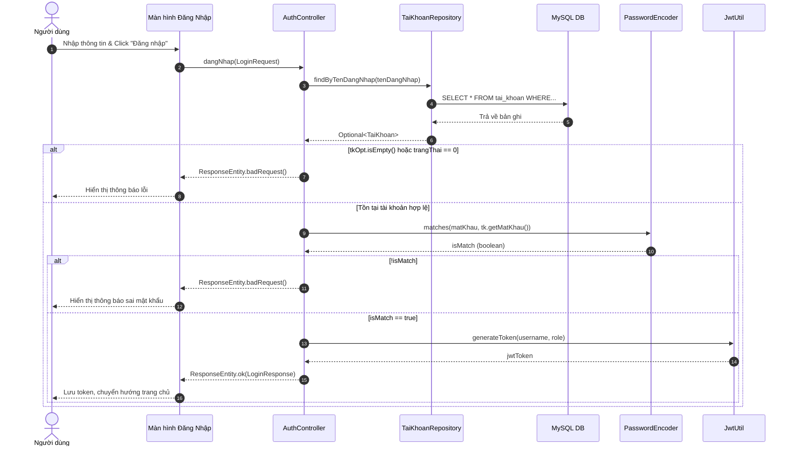

# SQ01 — Hướng dẫn vẽ sequence: Đăng nhập vào hệ thống

Ngày: 03/10/2026. Phạm vi: hướng dẫn vẽ thủ công trong Enterprise Architect (EA), ở mức chi tiết code (Controller, Utility, Repository).

## 1. Mục tiêu, điểm bắt đầu và điểm kết thúc

**Mục tiêu:** Người dùng (Quản lý, Phục vụ, Thu ngân, Admin...) xác thực danh tính để truy cập vào hệ thống.
**Bắt đầu:** Người dùng mở ứng dụng và ở tại giao diện đăng nhập (Màn hình Đăng Nhập / `Login.jsx`).
**Thành công:** Kiểm tra đúng tài khoản, mật khẩu, trạng thái không bị khóa. Trả về JWT Token cùng thông tin nhân viên, điều hướng vào trang chủ.
**Không thành công:** Sai thông tin hoặc tài khoản bị khóa. Hiển thị thông báo lỗi, không cho phép truy cập.

## 2. Các thành phần cần đặt trong EA (Lifelines)

Đặt các lifeline từ trái sang phải theo đúng kiến trúc mã nguồn:

| Thứ tự | Tên hiển thị | Loại/vai trò | Trách nhiệm |
| --- | --- | --- | --- |
| 1 | Người dùng | Actor | Nhập tên đăng nhập, mật khẩu và nhận thông báo/điều hướng. |
| 2 | Màn hình Đăng Nhập | Boundary (View) | Giao diện `Login.jsx`, nhận input, gọi API backend và hiển thị lỗi. |
| 3 | AuthController | Control (Controller) | Nhận HTTP Request POST, xử lý nghiệp vụ xác thực. |
| 4 | TaiKhoanRepository | Entity (Repository) | Giao tiếp cơ sở dữ liệu để tìm tài khoản. |
| 5 | MySQL DB | Database | Thực thi truy vấn dữ liệu tài khoản. |
| 6 | PasswordEncoder | Control (Utility) | So sánh mật khẩu đã băm (Bcrypt). |
| 7 | JwtUtil | Control (Utility) | Sinh JWT Token. |

*Thành phần bổ sung:*
- **Combined Fragment `alt` (Tồn tại tài khoản & Trạng thái)**: Phân biệt tài khoản hợp lệ với tài khoản không tồn tại / bị khóa.
- **Combined Fragment `alt` (Kiểm tra mật khẩu)**: Phân biệt sai mật khẩu và đúng mật khẩu.

## 3. Thông tin gửi và kiểm tra nghiệp vụ

**Dữ liệu gửi:** Đối tượng `LoginRequest` (gồm `tenDangNhap`, `matKhau`).

| Trường/quy tắc | Kiểm tra xử lý trong mã nguồn |
| --- | --- |
| Tìm tài khoản | Dùng `taiKhoanRepository.findByTenDangNhap(tenDangNhap)`. Nếu trả về `Optional.empty()`, báo lỗi. |
| Trạng thái | Thuộc tính `trangThai == 0` (Bị khóa) -> Trả về lỗi. |
| Mật khẩu | So sánh qua `passwordEncoder.matches(matKhau, tk.getMatKhau())`. |
| Sinh Token | Nếu đúng, dùng `jwtUtil.generateToken(username, role)` để trả về token đăng nhập. |

## 4. Thứ tự thông điệp để vẽ

| Mã | Từ → Đến | Nhãn trên mũi tên (Tên hàm/Tham số) | Vị trí/ý nghĩa |
| --- | --- | --- | --- |
| M01 | Người dùng → Màn hình Đăng Nhập | Nhập thông tin và chọn Đăng nhập | (Asynchronous) Truyền `TenDangNhap`, `MatKhau` |
| M02 | Màn hình Đăng Nhập → AuthController | `dangNhap(LoginRequest)` | (Synchronous) Gửi API `POST /api/auth/login` |
| M03 | AuthController → TaiKhoanRepository | `findByTenDangNhap(request.getTenDangNhap())` | (Synchronous) Tìm kiếm tài khoản |
| M04 | TaiKhoanRepository → MySQL DB | `SELECT * FROM tai_khoan WHERE ten_dang_nhap = ?` | (Synchronous) Query DB |
| M05 | MySQL DB → TaiKhoanRepository | Trả về dữ liệu bản ghi | (Return) Dữ liệu raw |
| M06 | TaiKhoanRepository → AuthController | Trả về `Optional<TaiKhoan>` | (Return) |
| **Fragment** | **`alt` (Kiểm tra tồn tại và trạng thái)** | `[tkOpt.isEmpty() == true hoặc tk.getTrangThai() == 0]` | **Bắt đầu kiểm tra điều kiện** |
| M07 | AuthController → Màn hình Đăng Nhập | `ResponseEntity.badRequest("Lỗi...")` | (Return) Sai tài khoản hoặc bị khóa |
| M08 | Màn hình Đăng Nhập → Người dùng | Hiển thị thông báo lỗi | (Asynchronous) Kết thúc nhánh lỗi |
| **Fragment** | **`[else]` (Tồn tại và hợp lệ)** | `[Tồn tại tài khoản hợp lệ]` | |
| M09 | AuthController → PasswordEncoder | `matches(request.getMatKhau(), tk.getMatKhau())` | (Synchronous) Kiểm tra băm mật khẩu |
| M10 | PasswordEncoder → AuthController | Trả về `boolean isMatch` | (Return) Kết quả true/false |
| **Fragment** | **`alt` (Kiểm tra mật khẩu)** | `[!isMatch]` | **Kiểm tra đúng sai mật khẩu** |
| M11 | AuthController → Màn hình Đăng Nhập | `ResponseEntity.badRequest("Sai tên đăng nhập...")`| (Return) Sai mật khẩu |
| M12 | Màn hình Đăng Nhập → Người dùng | Hiển thị thông báo sai mật khẩu | (Asynchronous) Kết thúc nhánh sai MK |
| **Fragment** | **`[else]` (Mật khẩu đúng)** | `[isMatch == true]` | |
| M13 | AuthController → JwtUtil | `generateToken(username, role)` | (Synchronous) Tạo JWT |
| M14 | JwtUtil → AuthController | Trả về chuỗi Token `jwtToken` | (Return) |
| M15 | AuthController → Màn hình Đăng Nhập | `ResponseEntity.ok(LoginResponse)` | (Return) Chứa maNV, hoTen, vaiTro, token |
| M16 | Màn hình Đăng Nhập → Người dùng | Lưu LocalStorage, chuyển hướng trang chủ | (Asynchronous) Kết thúc thành công |

## 5. Phác thảo bố cục bằng văn bản (Mermaid)

## 6. Các note nên gắn và thứ tự dựng sơ đồ

1. Gắn Note gần M02: **"Thông tin đăng nhập: Tên đăng nhập và Mật khẩu. Gửi qua POST Request"**
2. Gắn Note ở `alt` kiểm tra mật khẩu: **"Sử dụng Bcrypt qua PasswordEncoder để so sánh mật khẩu an toàn, không lưu plain text."**
3. Thứ tự vẽ: Đặt Actor và Boundary (UI) trước, sau đó là Controller. Dựng các luồng Synchronous trước, bọc lại bằng Fragment `alt` cho các điều kiện rẽ nhánh (Lỗi DB / Lỗi Validation) và cuối cùng là trả về Asynchronous.

## 7. Kiểm tra trước khi hoàn tất

- [x] Đã đủ Lifeline đại diện cho Frontend (React) và Backend (Spring Boot: Controller, Repo, Utils).
- [x] Rõ ràng ngòi mũi tên: Solid (hành động đồng bộ - Synchronous), Dashed (trả kết quả - Return), Open (không đồng bộ - Asynchronous cho Actor).
- [x] Tên hàm, tham số chính xác theo `AuthController.java` (ví dụ `dangNhap(LoginRequest request)`).
- [x] Đã xử lý đầy đủ các kịch bản nhánh rẽ (Sai tên/Khóa tài khoản, Sai mật khẩu, Thành công).
