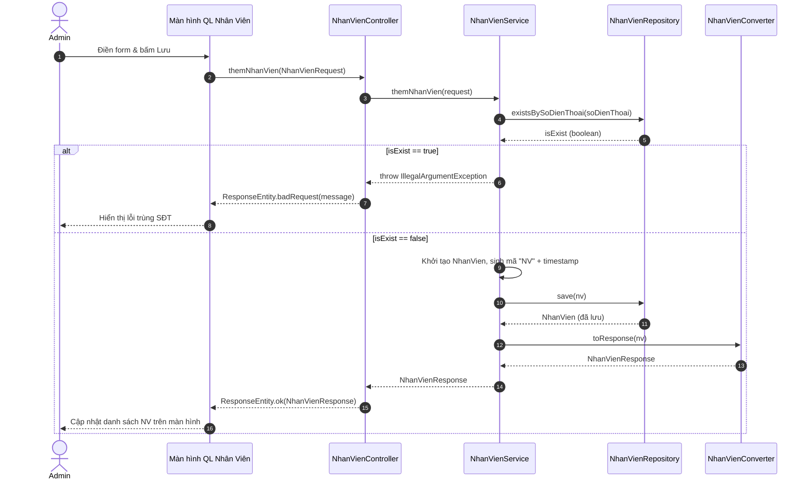

# SQ02 — Hướng dẫn vẽ sequence: Thêm thông tin nhân viên

Ngày: 03/10/2026. Phạm vi: hướng dẫn vẽ thủ công trong Enterprise Architect (EA), ở mức chi tiết code (Controller, Service, Repository).

## 1. Mục tiêu, điểm bắt đầu và điểm kết thúc

**Mục tiêu:** Quản trị viên (Admin) thêm mới hồ sơ thông tin của một nhân viên vào hệ thống.
**Bắt đầu:** Admin ở trang Quản lý nhân viên (`Admin.jsx`), mở form "Thêm nhân viên".
**Thành công:** Tạo mã nhân viên tự động, kiểm tra số điện thoại chưa tồn tại, lưu xuống DB. Trả về thông tin nhân viên đã tạo và hiển thị lên danh sách.
**Không thành công:** Số điện thoại đã bị trùng. Hệ thống báo lỗi và không tạo mới dữ liệu.

## 2. Các thành phần cần đặt trong EA (Lifelines)

| Thứ tự | Tên hiển thị | Loại/vai trò | Trách nhiệm |
| --- | --- | --- | --- |
| 1 | Admin | Actor | Nhập thông tin nhân viên (họ tên, vai trò, số điện thoại) và bấm lưu. |
| 2 | Màn hình Quản Lý Nhân Viên | Boundary (View) | Giao diện quản lý (`Admin.jsx`), gửi HTTP Request, hiển thị dữ liệu/lỗi. |
| 3 | NhanVienController | Control (Controller) | Nhận POST Request, bắt lỗi `IllegalArgumentException` và trả về HTTP Status tương ứng. |
| 4 | NhanVienService | Control (Service) | Xử lý logic nghiệp vụ, kiểm tra trùng lặp và sinh mã nhân viên. |
| 5 | NhanVienRepository | Entity (Repository) | Giao tiếp CSDL, kiểm tra SĐT và lưu entity `NhanVien`. |
| 6 | NhanVienConverter | Control (Utility) | Chuyển đổi từ đối tượng Entity sang DTO để trả về. |

*Thành phần bổ sung:*
- **Combined Fragment `alt` (Kiểm tra trùng SĐT)**: Xử lý rẽ nhánh khi số điện thoại đã tồn tại.

## 3. Thông tin gửi và kiểm tra nghiệp vụ

**Dữ liệu gửi:** Đối tượng `NhanVienRequest` (gồm `hoTen`, `vaiTro`, `soDienThoai`).

| Trường/quy tắc | Kiểm tra xử lý trong mã nguồn |
| --- | --- |
| Trùng lặp SĐT | Dùng `nhanVienRepository.existsBySoDienThoai(soDienThoai)`. Nếu `true`, văng `IllegalArgumentException`. |
| Mã Nhân Viên | Sinh tự động theo quy tắc `"NV" + System.currentTimeMillis()`. |
| Vai Trò | Kiểu `Enum VaiTro`, lấy trực tiếp từ Request. |
| Trả kết quả | Nếu thành công, `NhanVienController` bắt ngoại lệ hợp lệ, dùng `NhanVienConverter` chuyển DTO, bọc trong `ResponseEntity.ok`. |

## 4. Thứ tự thông điệp để vẽ

| Mã | Từ → Đến | Nhãn trên mũi tên (Tên hàm/Tham số) | Vị trí/ý nghĩa |
| --- | --- | --- | --- |
| M01 | Admin → Màn hình Quản Lý Nhân Viên | Điền thông tin và bấm Lưu | (Asynchronous) |
| M02 | Màn hình Quản Lý Nhân Viên → NhanVienController | `themNhanVien(NhanVienRequest)` | (Synchronous) Gửi API `POST /api/nhan-vien` |
| M03 | NhanVienController → NhanVienService | `themNhanVien(request)` | (Synchronous) |
| M04 | NhanVienService → NhanVienRepository | `existsBySoDienThoai(request.getSoDienThoai())` | (Synchronous) |
| M05 | NhanVienRepository → NhanVienService | Trả về `boolean isExist` | (Return) |
| **Fragment** | **`alt` (Kiểm tra trùng SĐT)** | `[isExist == true]` | **Nhánh SĐT đã đăng ký** |
| M06 | NhanVienService → NhanVienController | Văng `IllegalArgumentException` | (Return) "Số điện thoại này đã được đăng ký..." |
| M07 | NhanVienController → Màn hình Quản Lý Nhân Viên | `ResponseEntity.badRequest("Lỗi...")` | (Return) HTTP 400 |
| M08 | Màn hình Quản Lý Nhân Viên → Admin | Hiển thị thông báo lỗi SĐT trùng | (Asynchronous) |
| **Fragment** | **`[else]` (Hợp lệ)** | `[isExist == false]` | |
| M09 | NhanVienService → NhanVienService | Khởi tạo `NhanVien`, gán MaNV, HoTen, VaiTro, SoDienThoai | (Self-message) Sinh ID |
| M10 | NhanVienService → NhanVienRepository | `save(nv)` | (Synchronous) Lưu DB |
| M11 | NhanVienRepository → NhanVienService | Trả về `NhanVien` đã lưu | (Return) |
| M12 | NhanVienService → NhanVienConverter | `toResponse(savedNhanVien)` | (Synchronous) Chuyển đổi sang DTO |
| M13 | NhanVienConverter → NhanVienService | Trả về `NhanVienResponse` | (Return) |
| M14 | NhanVienService → NhanVienController | Trả về `NhanVienResponse` | (Return) |
| M15 | NhanVienController → Màn hình Quản Lý Nhân Viên | `ResponseEntity.ok(NhanVienResponse)` | (Return) HTTP 200 |
| M16 | Màn hình Quản Lý Nhân Viên → Admin | Đóng modal, cập nhật danh sách | (Asynchronous) |

## 5. Phác thảo bố cục bằng văn bản (Mermaid)

## 6. Các note nên gắn và thứ tự dựng sơ đồ

1. Gắn Note gần hàm `save`: **"MaNV được sinh động bằng cách nối 'NV' với timestamp. Các thuộc tính khác lấy từ request."**
2. Thứ tự vẽ: Controller -> Service -> Repo (kiểm tra SĐT) -> Nhánh lỗi -> Nhánh thành công thì lưu và gọi Converter.
3. Chú ý luồng ngoại lệ: Service không trả trực tiếp ResponseEntity mà ném Exception, Controller dùng khối `try...catch(IllegalArgumentException)` để bắt và trả về `badRequest`.

## 7. Kiểm tra trước khi hoàn tất

- [x] Đã phản ánh đúng Exception Handling của `NhanVienController` và `NhanVienServiceImpl`.
- [x] Rõ ràng ngòi mũi tên, đặc biệt Self-message cho việc sinh ID.
- [x] Có sự xuất hiện của `NhanVienConverter` theo như file code.
- [x] Guard condition trong các nhánh kiểm tra được viết theo đúng logic `if(existsBySoDienThoai)`.
