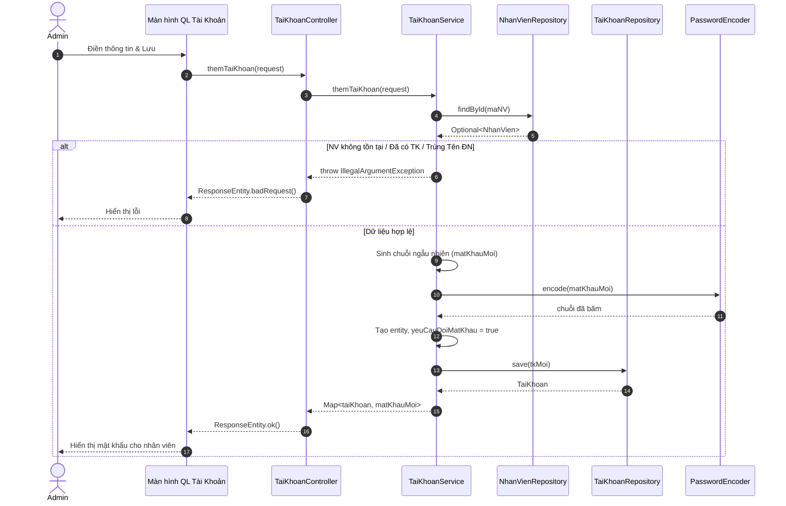

# SQ03 — Hướng dẫn vẽ sequence: Thêm tài khoản nhân viên

Ngày: 03/10/2026. Phạm vi: hướng dẫn vẽ thủ công trong Enterprise Architect (EA), ở mức chi tiết code (Controller, Service, Repository).

## 1. Mục tiêu, điểm bắt đầu và điểm kết thúc

**Mục tiêu:** Quản trị viên (Admin) cấp tài khoản đăng nhập cho một nhân viên chưa có tài khoản.
**Bắt đầu:** Admin ở trang Quản lý tài khoản (`Admin.jsx`), mở form "Cấp tài khoản" cho nhân viên được chọn.
**Thành công:** Tạo tài khoản thành công với mật khẩu ngẫu nhiên (được băm), yêu cầu đổi mật khẩu lần đầu bật. Hệ thống hiển thị mật khẩu mới cho Admin gửi cho nhân viên.
**Không thành công:** Nhân viên không tồn tại, đã có tài khoản, hoặc tên đăng nhập trùng. Hệ thống báo lỗi.

## 2. Các thành phần cần đặt trong EA (Lifelines)

| Thứ tự | Tên hiển thị | Loại/vai trò | Trách nhiệm |
| --- | --- | --- | --- |
| 1 | Admin | Actor | Nhập tên đăng nhập, chọn nhân viên và gửi yêu cầu cấp tài khoản. |
| 2 | Màn hình Quản Lý Tài Khoản | Boundary (View) | Giao diện (`Admin.jsx`), truyền dữ liệu, hiển thị tài khoản mới và mật khẩu. |
| 3 | TaiKhoanController | Control (Controller) | Xử lý request, bắt lỗi (Exception) và trả về dữ liệu. |
| 4 | TaiKhoanService | Control (Service) | Kiểm tra nghiệp vụ, sinh mật khẩu ngẫu nhiên, tạo tài khoản. |
| 5 | NhanVienRepository | Entity (Repository) | Truy vấn thông tin nhân viên theo `maNV`. |
| 6 | TaiKhoanRepository | Entity (Repository) | Truy vấn kiểm tra trùng lặp và lưu trữ tài khoản. |
| 7 | PasswordEncoder | Control (Utility) | Băm mật khẩu ngẫu nhiên bằng thuật toán (Bcrypt). |

## 3. Thông tin gửi và kiểm tra nghiệp vụ

**Dữ liệu gửi:** Đối tượng `TaiKhoanRequest` (gồm `maNV`, `tenDangNhap`).

| Trường/quy tắc | Kiểm tra xử lý trong mã nguồn |
| --- | --- |
| Tồn tại nhân viên | `nhanVienRepository.findById(maNV)`. Trống -> Lỗi. |
| Đã có tài khoản | `taiKhoanRepository.existsById(maNV)`. Đã có -> Lỗi. |
| Tên đăng nhập | `taiKhoanRepository.existsByTenDangNhap(tenDangNhap)`. Trùng -> Lỗi. |
| Mật khẩu | Sinh ngẫu nhiên 8 ký tự, băm qua `PasswordEncoder.encode()`. |
| Thuộc tính khác | Gán `yeuCauDoiMatKhau = true` và `trangThai = 1`. |

## 4. Thứ tự thông điệp để vẽ

| Mã | Từ → Đến | Nhãn trên mũi tên (Tên hàm/Tham số) | Vị trí/ý nghĩa |
| --- | --- | --- | --- |
| M01 | Admin → Màn hình QL Tài Khoản | Nhập thông tin & Click Lưu | (Asynchronous) |
| M02 | Màn hình QL Tài Khoản → TaiKhoanController | `themTaiKhoan(TaiKhoanRequest)` | (Synchronous) Gửi API `POST /api/tai-khoan` |
| M03 | TaiKhoanController → TaiKhoanService | `themTaiKhoan(request)` | (Synchronous) |
| M04 | TaiKhoanService → NhanVienRepository | `findById(maNV)` | (Synchronous) KT Nhân viên |
| M05 | NhanVienRepository → TaiKhoanService | Trả về `Optional<NhanVien>` | (Return) |
| **Fragment** | **`alt` (Điều kiện lỗi 1, 2, 3)** | `[Không tìm thấy NV hoặc Đã có TK hoặc Trùng tên ĐN]` | **Nhiều if văng lỗi** (gom chung hoặc rẽ nhánh tùy EA) |
| M06 | TaiKhoanService → TaiKhoanController | Ném `IllegalArgumentException` | (Return) Lỗi tương ứng |
| M07 | TaiKhoanController → Màn hình QL Tài Khoản | `ResponseEntity.badRequest(msg)` | (Return) HTTP 400 |
| M08 | Màn hình QL Tài Khoản → Admin | Hiển thị cảnh báo lỗi | (Asynchronous) |
| **Fragment** | **`[else]` (Hợp lệ)** | `[Điều kiện đạt]` | (Gọi `existsById`, `existsByTenDangNhap` đạt) |
| M09 | TaiKhoanService → TaiKhoanService | Sinh `matKhauMoi` ngẫu nhiên (8 ký tự) | (Self-message) |
| M10 | TaiKhoanService → PasswordEncoder | `encode(matKhauMoi)` | (Synchronous) |
| M11 | PasswordEncoder → TaiKhoanService | Trả về mật khẩu đã băm | (Return) |
| M12 | TaiKhoanService → TaiKhoanService | Khởi tạo `TaiKhoan`, gán password băm, set `yeuCauDoiMatKhau = true` | (Self-message) |
| M13 | TaiKhoanService → TaiKhoanRepository | `save(tkMoi)` | (Synchronous) Lưu DB |
| M14 | TaiKhoanRepository → TaiKhoanService | Trả về tài khoản đã lưu | (Return) |
| M15 | TaiKhoanService → TaiKhoanController | Trả về `Map<String, Object>` | (Return) Chứa `taiKhoan` và `matKhauMoi` text thường |
| M16 | TaiKhoanController → Màn hình QL Tài Khoản | `ResponseEntity.ok(responseMap)` | (Return) HTTP 200 |
| M17 | Màn hình QL Tài Khoản → Admin | Hiển thị mật khẩu mới, cập nhật danh sách | (Asynchronous) |

## 5. Phác thảo bố cục bằng văn bản (Mermaid)

## 6. Các note nên gắn và thứ tự dựng sơ đồ

1. Note gần M12: **"Bắt buộc yêu cầu đổi mật khẩu ở lần đăng nhập đầu tiên (yeuCauDoiMatKhau = true)."**
2. Note gần PE: **"Mật khẩu lưu xuống DB là chuỗi băm Bcrypt, API trả về mật khẩu gốc cho UI để hiển thị 1 lần duy nhất."**
3. Trong EA, đối với điều kiện lỗi, có thể gom chung `alt` thành 1 khối hoặc vẽ 3 `alt` lồng nhau. Để gọn gàng, gom vào 1 `alt` điều kiện lỗi "Nếu vi phạm quy tắc" và 1 `else` "Hợp lệ".

## 7. Kiểm tra trước khi hoàn tất
- [x] Đã phản ánh chi tiết cách check tồn tại nhân viên (qua `NhanVienRepository.findById`).
- [x] Rõ ràng luồng mã hóa qua `PasswordEncoder` trước khi gọi `save()`.
- [x] Dữ liệu trả về từ Controller là một `Map` chứ không phải DTO đơn thuần, nhằm đính kèm `matKhauMoi`.
