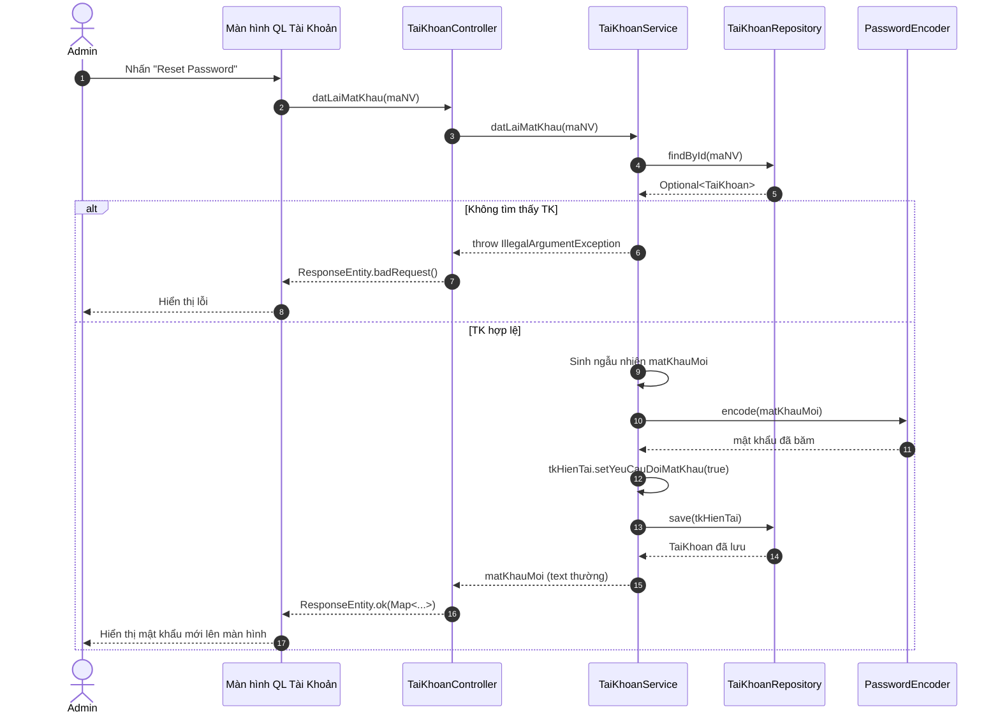

# SQ04 — Hướng dẫn vẽ sequence: Đặt lại mật khẩu tài khoản

Ngày: 03/10/2026. Phạm vi: hướng dẫn vẽ thủ công trong Enterprise Architect (EA), ở mức chi tiết code (Controller, Service, Repository).

## 1. Mục tiêu, điểm bắt đầu và điểm kết thúc

**Mục tiêu:** Quản trị viên (Admin) khôi phục / đặt lại mật khẩu cho nhân viên khi họ quên.
**Bắt đầu:** Admin ở trang Quản lý tài khoản (`Admin.jsx`), nhấn nút "Reset Password" trên một dòng tài khoản.
**Thành công:** Hệ thống tạo mật khẩu ngẫu nhiên mới, cập nhật vào cơ sở dữ liệu và yêu cầu nhân viên đổi mật khẩu ở lần đăng nhập sau. Giao diện hiển thị mật khẩu mới.
**Không thành công:** Không tìm thấy tài khoản (đã bị xóa bởi Admin khác). Hệ thống báo lỗi.

## 2. Các thành phần cần đặt trong EA (Lifelines)

| Thứ tự | Tên hiển thị | Loại/vai trò | Trách nhiệm |
| --- | --- | --- | --- |
| 1 | Admin | Actor | Nhấn Reset Password và nhận mật khẩu mới. |
| 2 | Màn hình Quản Lý Tài Khoản | Boundary (View) | Giao diện (`Admin.jsx`), gọi API Reset. |
| 3 | TaiKhoanController | Control (Controller) | Nhận PUT Request, trả về mật khẩu ngẫu nhiên. |
| 4 | TaiKhoanService | Control (Service) | Logic kiểm tra, tạo chuỗi ngẫu nhiên, băm mật khẩu. |
| 5 | TaiKhoanRepository | Entity (Repository) | Truy vấn tài khoản, lưu mật khẩu. |
| 6 | PasswordEncoder | Control (Utility) | Băm mật khẩu mới thành Bcrypt hash. |

## 3. Thông tin gửi và kiểm tra nghiệp vụ

**Dữ liệu gửi:** HTTP PUT Request, tham số `maNV` trên đường dẫn URL.

| Trường/quy tắc | Kiểm tra xử lý trong mã nguồn |
| --- | --- |
| Tồn tại tài khoản | `taiKhoanRepository.findById(maNV)`. Trống -> Văng lỗi. |
| Đặt lại mật khẩu | Sinh ngẫu nhiên 8 ký tự, băm bằng `PasswordEncoder.encode()`. |
| Bắt buộc đổi MK | Gán `tkHienTai.setYeuCauDoiMatKhau(true)`. |

## 4. Thứ tự thông điệp để vẽ

| Mã | Từ → Đến | Nhãn trên mũi tên (Tên hàm/Tham số) | Vị trí/ý nghĩa |
| --- | --- | --- | --- |
| M01 | Admin → Màn hình QL Tài Khoản | Nhấn nút Reset Password | (Asynchronous) |
| M02 | Màn hình QL Tài Khoản → TaiKhoanController | `datLaiMatKhau(maNV)` | (Synchronous) Gửi API `PUT /api/tai-khoan/{maNV}/reset-password` |
| M03 | TaiKhoanController → TaiKhoanService | `datLaiMatKhau(maNV)` | (Synchronous) |
| M04 | TaiKhoanService → TaiKhoanRepository | `findById(maNV)` | (Synchronous) Kiểm tra TK |
| M05 | TaiKhoanRepository → TaiKhoanService | Trả về `Optional<TaiKhoan>` | (Return) |
| **Fragment** | **`alt` (Tài khoản không tồn tại)** | `[tkOpt.isEmpty() == true]` | |
| M06 | TaiKhoanService → TaiKhoanController | Ném `IllegalArgumentException` | (Return) |
| M07 | TaiKhoanController → Màn hình QL Tài Khoản | `ResponseEntity.badRequest(msg)` | (Return) HTTP 400 |
| M08 | Màn hình QL Tài Khoản → Admin | Hiển thị thông báo không tìm thấy | (Asynchronous) |
| **Fragment** | **`[else]` (Hợp lệ)** | `[tkOpt.isPresent()]` | |
| M09 | TaiKhoanService → TaiKhoanService | Sinh `matKhauMoi` ngẫu nhiên 8 ký tự | (Self-message) |
| M10 | TaiKhoanService → PasswordEncoder | `encode(matKhauMoi)` | (Synchronous) |
| M11 | PasswordEncoder → TaiKhoanService | Trả về mật khẩu đã băm | (Return) |
| M12 | TaiKhoanService → TaiKhoanService | Set `matKhau` băm, `yeuCauDoiMatKhau = true` | (Self-message) Cập nhật đối tượng |
| M13 | TaiKhoanService → TaiKhoanRepository | `save(tkHienTai)` | (Synchronous) Lưu DB |
| M14 | TaiKhoanRepository → TaiKhoanService | Trả về `TaiKhoan` đã lưu | (Return) |
| M15 | TaiKhoanService → TaiKhoanController | Trả về `matKhauMoi` (text thường) | (Return) String |
| M16 | TaiKhoanController → Màn hình QL Tài Khoản | `ResponseEntity.ok(Map.of("matKhauMoi", matKhauMoi))` | (Return) Đóng gói JSON |
| M17 | Màn hình QL Tài Khoản → Admin | Hiện Modal chứa mật khẩu mới cho NV | (Asynchronous) |

## 5. Phác thảo bố cục bằng văn bản (Mermaid)

## 6. Các note nên gắn và thứ tự dựng sơ đồ

1. Gắn Note gần M02: **"Gọi API PUT không body, truyền maNV trên URL (Path Variable)."**
2. Gắn Note gần M12: **"Gán lại cờ yêu cầu đổi mật khẩu (yeuCauDoiMatKhau = true) bắt buộc nhân viên đổi khi đăng nhập lại."**
3. Logic sinh chuỗi và encode hoàn toàn nằm trong lớp `Service`, `Controller` chỉ bọc lại thành `ResponseEntity`.

## 7. Kiểm tra trước khi hoàn tất
- [x] Sơ đồ tập trung vào cập nhật (PUT), không gọi `NhanVienRepository` như chức năng Thêm.
- [x] Thể hiện đúng logic trả về `Map` có chứa mật khẩu plain-text chưa băm.
- [x] Có `PasswordEncoder` trong sơ đồ để làm rõ việc không lưu plain-text xuống DB.
