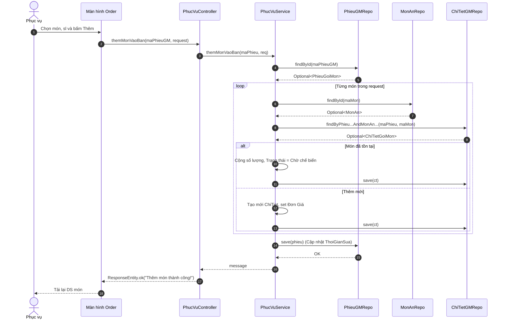

# SQ05 — Hướng dẫn vẽ sequence: Ghi nhận gọi món (Thêm món)

Ngày: 03/10/2026. Phạm vi: hướng dẫn vẽ thủ công trong Enterprise Architect (EA), ở mức chi tiết code.

## 1. Mục tiêu, điểm bắt đầu và điểm kết thúc

**Mục tiêu:** Nhân viên Phục vụ ghi nhận các món ăn/đồ uống khách gọi vào bàn.
**Bắt đầu:** Phục vụ đứng tại màn hình Giao diện Gọi món (Tab Thực đơn), chọn món, nhập số lượng và bấm "Thêm vào bàn".
**Thành công:** Kiểm tra và lưu thông tin chi tiết các món vào cơ sở dữ liệu với trạng thái "Chờ chế biến". Nếu món đã có, cộng dồn số lượng. Cập nhật thời gian sửa phiếu.
**Không thành công:** Không tìm thấy phiếu gọi món, hoặc món ăn không tồn tại.

## 2. Các thành phần cần đặt trong EA (Lifelines)

| Thứ tự | Tên hiển thị | Loại/vai trò | Trách nhiệm |
| --- | --- | --- | --- |
| 1 | Phục vụ | Actor | Chọn món, chọn số lượng và xác nhận thêm món. |
| 2 | Màn hình Order | Boundary (View) | Màn hình của Nhân viên phục vụ (`Waiter.jsx`), thu thập danh sách món. |
| 3 | PhucVuController | Control (Controller) | Nhận API POST `themMonVaoBan`. |
| 4 | PhucVuService | Control (Service) | Xử lý logic cộng dồn hoặc thêm mới chi tiết món, thiết lập trạng thái. |
| 5 | PhieuGoiMonRepository| Entity (Repository) | Truy vấn tìm phiếu gọi món. |
| 6 | MonAnRepository | Entity (Repository) | Truy vấn tìm kiếm thông tin món ăn (giá, tên). |
| 7 | ChiTietGoiMonRepository| Entity (Repository) | Kiểm tra món đã gọi và lưu chi tiết (Insert/Update). |

## 3. Thông tin gửi và kiểm tra nghiệp vụ

**Dữ liệu gửi:** HTTP POST kèm theo `maPhieuGM` trên URL, body là đối tượng `ThemMonRequest` (chứa danh sách `MonDuocChon`).

| Trường/quy tắc | Kiểm tra xử lý trong mã nguồn |
| --- | --- |
| Phiếu gọi món | `phieuGoiMonRepository.findById(maPhieuGM)`. Trống -> Lỗi. |
| Món ăn | Duyệt danh sách gọi, tìm bằng `monAnRepository.findById(maMon)`. Trống -> Lỗi. |
| Cộng dồn số lượng | Kiểm tra qua khóa kép (maPhieuGM, maMon). Nếu có -> Update `SoLuong = SoLuong + them`, Trạng thái = "Chờ chế biến". Nếu chưa có -> Tạo dòng mới (Insert) với đơn giá hiện tại. |
| Cập nhật Phiếu | Lưu lại thời gian thay đổi (`ThoiGianSua`) của Phiếu Gọi Món gốc. |

## 4. Thứ tự thông điệp để vẽ

Do có vòng lặp duyệt qua danh sách các món, trong EA có thể bọc trong một Combined Fragment `loop` cho các thông điệp từ M06 trở đi.

| Mã | Từ → Đến | Nhãn trên mũi tên (Tên hàm/Tham số) | Vị trí/ý nghĩa |
| --- | --- | --- | --- |
| M01 | Phục vụ → Màn hình Order | Chọn món, số lượng & Lưu | (Asynchronous) |
| M02 | Màn hình Order → PhucVuController | `themMonVaoBan(maPhieuGM, request)` | (Synchronous) |
| M03 | PhucVuController → PhucVuService | `themMonVaoBan(maPhieuGM, request)` | (Synchronous) |
| M04 | PhucVuService → PhieuGoiMonRepository | `findById(maPhieuGM)` | (Synchronous) Kiểm tra phiếu |
| M05 | PhieuGoiMonRepository → PhucVuService | Trả về `Optional<PhieuGoiMon>` | (Return) |
| **Fragment** | **`loop` (Duyệt danh sách món req)** | `[Cho mỗi monReq trong request]` | |
| M06 | PhucVuService → MonAnRepository | `findById(monReq.getMaMon())` | (Synchronous) |
| M07 | MonAnRepository → PhucVuService | Trả về `Optional<MonAn>` | (Return) |
| M08 | PhucVuService → ChiTietGoiMonRepository| `findByPhieuGoiMon...AndMonAn...(maPhieu, maMon)`| (Synchronous) Ktra đã gọi chưa |
| M09 | ChiTietGoiMonRepository → PhucVuService | Trả về `Optional<ChiTietGoiMon>` | (Return) |
| **Fragment** | **`alt` (Món đã có sẵn)** | `[tonTai.isPresent()]` | |
| M10 | PhucVuService → PhucVuService | Cộng số lượng, set "Chờ chế biến" | (Self-message) |
| **Fragment** | **`[else]` (Món gọi mới)** | `[tonTai.isEmpty()]` | |
| M11 | PhucVuService → PhucVuService | Khởi tạo ChiTietGoiMon, gán giá, "Chờ chế biến" | (Self-message) |
| M12 | PhucVuService → ChiTietGoiMonRepository| `save(ct)` | (Synchronous) Lưu DB nhánh alt |
| M13 | ChiTietGoiMonRepository → PhucVuService | Trả về Object | (Return) (Ra khỏi loop) |
| M14 | PhucVuService → PhieuGoiMonRepository | `save(phieu)` | (Synchronous) Cập nhật ThoiGianSua |
| M15 | PhieuGoiMonRepository → PhucVuService | Trả về Object | (Return) |
| M16 | PhucVuService → PhucVuController | Xử lý xong (void/return text) | (Return) "Thêm món thành công!" |
| M17 | PhucVuController → Màn hình Order | `ResponseEntity.ok(message)` | (Return) |
| M18 | Màn hình Order → Phục vụ | Hiển thị thông báo, cập nhật bàn | (Asynchronous) |

## 5. Phác thảo bố cục bằng văn bản (Mermaid)

## 6. Các note nên gắn và thứ tự dựng sơ đồ

1. Note gần chỗ gọi `save(ct)`: **"Trạng thái bếp được gán cứng là 'Chờ chế biến'. Đơn giá món được lưu cứng theo thời điểm gọi để sau này xuất hóa đơn không bị ảnh hưởng nếu đổi giá món."**
2. Khối `loop`: Bao bọc lấy phần tìm kiếm `MonAn` và `ChiTietGoiMon`, bởi vì Request có thể mang theo 1 mảng các món.

## 7. Kiểm tra trước khi hoàn tất
- [x] Sơ đồ chỉ ra rõ có Fragment `loop` để duyệt mảng `danhSachMon`.
- [x] Có kiểm tra qua khóa đôi (`maPhieuGM` và `maMon`).
- [x] Hành động cập nhật lại thời gian cập nhật của `PhieuGoiMon` cuối cùng được diễn đạt rõ.
