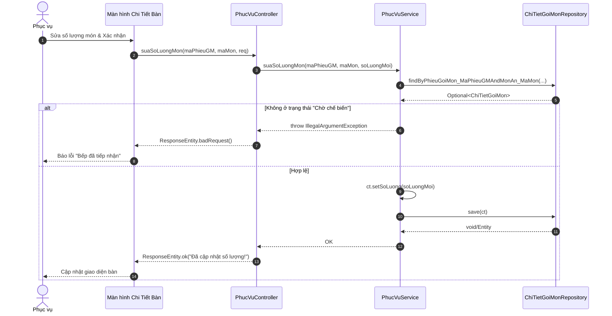

# SQ06 — Hướng dẫn vẽ sequence: Chỉnh sửa món gọi

Ngày: 03/10/2026. Phạm vi: hướng dẫn vẽ thủ công trong Enterprise Architect (EA), ở mức chi tiết code (Controller, Service, Repository).

## 1. Mục tiêu, điểm bắt đầu và điểm kết thúc

**Mục tiêu:** Nhân viên Phục vụ thay đổi số lượng món đã gọi trong hệ thống (thường do khách đổi ý).
**Bắt đầu:** Phục vụ ấn nút "Sửa" (Icon Cây bút) trên danh sách món đã đặt tại bàn, nhập số lượng mới và xác nhận.
**Thành công:** Hệ thống kiểm tra hợp lệ (số lượng > 0 và Bếp chưa nấu) và cập nhật số lượng mới.
**Không thành công:** Bếp đã tiếp nhận ("Đang nấu" / "Hoàn tất"), hệ thống từ chối sửa số lượng.

## 2. Các thành phần cần đặt trong EA (Lifelines)

| Thứ tự | Tên hiển thị | Loại/vai trò | Trách nhiệm |
| --- | --- | --- | --- |
| 1 | Phục vụ | Actor | Nhập số lượng mới. |
| 2 | Màn hình Chi Tiết Bàn | Boundary (View) | Gọi API PUT `suaSoLuongMon`. |
| 3 | PhucVuController | Control (Controller) | Nhận API, bọc ngoại lệ gửi lỗi về FE. |
| 4 | PhucVuService | Control (Service) | Kiểm tra điều kiện nghiệp vụ (Trạng thái bếp). |
| 5 | ChiTietGoiMonRepository| Entity (Repository) | Truy vấn tìm chi tiết món và lưu bản cập nhật. |

## 3. Thông tin gửi và kiểm tra nghiệp vụ

**Dữ liệu gửi:** HTTP PUT `.../phieu/{maPhieuGM}/mon/{maMon}`, Body: `SuaSoLuongRequest` (soLuongMoi).

| Trường/quy tắc | Kiểm tra xử lý trong mã nguồn |
| --- | --- |
| Hợp lệ số lượng | `soLuongMoi <= 0` -> Ném lỗi `IllegalArgumentException`. |
| Tồn tại món | `chiTietGoiMonRepository.findBy...(...)` -> Không tìm thấy báo lỗi. |
| Trạng thái bếp | `!"Chờ chế biến".equals(ct.getTrangThaiBep())` -> Ném lỗi "Bếp đã tiếp nhận món này...". |
| Thực thi | Gán số lượng mới và gọi `chiTietGoiMonRepository.save(ct)`. |

## 4. Thứ tự thông điệp để vẽ

| Mã | Từ → Đến | Nhãn trên mũi tên (Tên hàm/Tham số) | Vị trí/ý nghĩa |
| --- | --- | --- | --- |
| M01 | Phục vụ → Màn hình Chi Tiết Bàn | Nhập số lượng mới, bấm Lưu | (Asynchronous) |
| M02 | Màn hình Chi Tiết Bàn → PhucVuController | `suaSoLuongMon(maPhieu, maMon, req)`| (Synchronous) |
| M03 | PhucVuController → PhucVuService | `suaSoLuongMon(maPhieu, maMon, soLuongMoi)` | (Synchronous) |
| M04 | PhucVuService → ChiTietGoiMonRepository | `findByPhieu...AndMonAn...()` | (Synchronous) |
| M05 | ChiTietGoiMonRepository → PhucVuService | Trả về `Optional<ChiTietGoiMon>` | (Return) |
| **Fragment** | **`alt` (Bếp đã nấu hoặc số lượng <= 0)** | `[!ct.getTrangThaiBep().equals("Chờ chế biến")]`| **Khối rẽ nhánh lỗi nghiệp vụ** |
| M06 | PhucVuService → PhucVuController | Ném `IllegalArgumentException` | (Return) |
| M07 | PhucVuController → Màn hình Chi Tiết Bàn | `ResponseEntity.badRequest(msg)` | (Return) |
| M08 | Màn hình Chi Tiết Bàn → Phục vụ | Báo lỗi không cho sửa | (Asynchronous) |
| **Fragment** | **`[else]` (Được phép sửa)** | `[Trạng thái là Chờ chế biến]` | |
| M09 | PhucVuService → PhucVuService | Gán `ct.setSoLuong(soLuongMoi)` | (Self-message) |
| M10 | PhucVuService → ChiTietGoiMonRepository | `save(ct)` | (Synchronous) Lưu xuống DB |
| M11 | ChiTietGoiMonRepository → PhucVuService | Lưu thành công | (Return) |
| M12 | PhucVuService → PhucVuController | Trả về thành công | (Return) |
| M13 | PhucVuController → Màn hình Chi Tiết Bàn | `ResponseEntity.ok("Đã cập nhật...")` | (Return) |
| M14 | Màn hình Chi Tiết Bàn → Phục vụ | Tải lại danh sách, hiện Toast | (Asynchronous) |

## 5. Phác thảo bố cục bằng văn bản (Mermaid)

## 6. Các note nên gắn và thứ tự dựng sơ đồ
1. Gắn Note vào `alt`: **"Ràng buộc nghiệp vụ quan trọng: Chỉ khi bếp chưa đụng tay vào (Trạng thái = Chờ chế biến) thì mới được quyền sửa/hủy."**

## 7. Kiểm tra trước khi hoàn tất
- [x] Có thể hiện logic chặn khi `TrangThaiBep` bị thay đổi.
- [x] Cập nhật trên đúng đối tượng bảng trung gian (Chi Tiết Gọi Món), sử dụng Repository riêng của nó.
