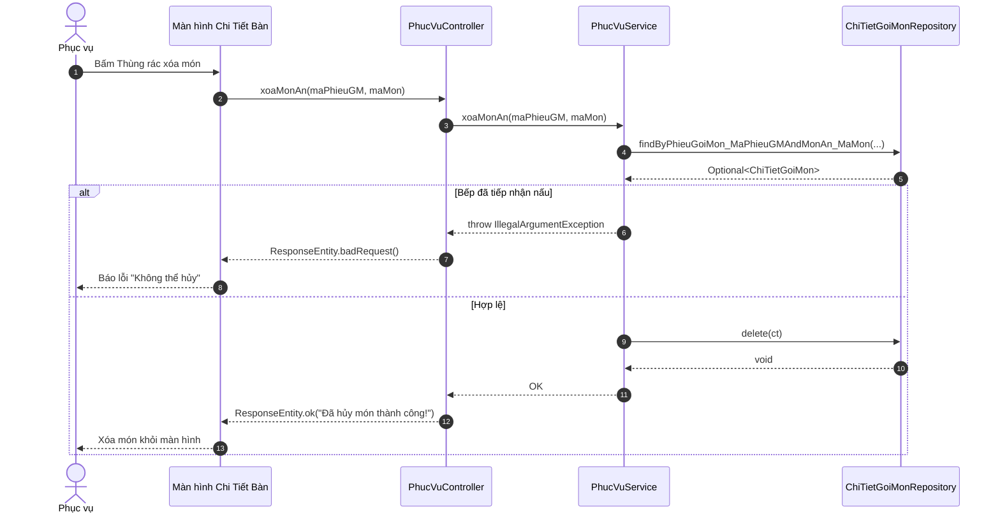

# SQ07 — Hướng dẫn vẽ sequence: Hủy món gọi

Ngày: 03/10/2026. Phạm vi: hướng dẫn vẽ thủ công trong Enterprise Architect (EA), ở mức chi tiết code (Controller, Service, Repository).

## 1. Mục tiêu, điểm bắt đầu và điểm kết thúc

**Mục tiêu:** Phục vụ hủy một món ăn khỏi phiếu gọi món (khách đổi ý không muốn ăn nữa hoặc phục vụ order nhầm).
**Bắt đầu:** Phục vụ ấn nút "Xóa" (Icon Thùng rác) tương ứng với một món trên Màn hình chi tiết bàn.
**Thành công:** Món bị xóa khỏi bảng chi tiết phiếu gọi món.
**Không thành công:** Bếp đã tiếp nhận nấu hoặc đã ra món, hệ thống chặn việc xóa và ném lỗi.

## 2. Các thành phần cần đặt trong EA (Lifelines)

| Thứ tự | Tên hiển thị | Loại/vai trò | Trách nhiệm |
| --- | --- | --- | --- |
| 1 | Phục vụ | Actor | Bấm hủy món và xác nhận. |
| 2 | Màn hình Chi Tiết Bàn | Boundary (View) | Gọi API DELETE, xử lý kết quả UI. |
| 3 | PhucVuController | Control (Controller) | Nhận API `DELETE /phieu/{maPhieuGM}/mon/{maMon}`. |
| 4 | PhucVuService | Control (Service) | Kiểm tra điều kiện "Chờ chế biến", tiến hành xóa. |
| 5 | ChiTietGoiMonRepository| Entity (Repository) | Truy vấn DB và chạy lệnh xóa (delete). |

## 3. Thông tin gửi và kiểm tra nghiệp vụ

**Dữ liệu gửi:** Path variable `maPhieuGM` và `maMon`. Không có Request Body.

| Trường/quy tắc | Kiểm tra xử lý trong mã nguồn |
| --- | --- |
| Tồn tại món | `chiTietGoiMonRepository.findBy...(...)` -> Bắt lỗi nếu không tìm thấy. |
| Trạng thái bếp | `!"Chờ chế biến".equals(ct.getTrangThaiBep())` -> Nếu Bếp đang làm, từ chối hủy. |
| Hủy dữ liệu | Dùng `chiTietGoiMonRepository.delete(ct)` để xóa vĩnh viễn dòng đó. |

## 4. Thứ tự thông điệp để vẽ

| Mã | Từ → Đến | Nhãn trên mũi tên (Tên hàm/Tham số) | Vị trí/ý nghĩa |
| --- | --- | --- | --- |
| M01 | Phục vụ → Màn hình Chi Tiết Bàn | Chọn Xóa món | (Asynchronous) |
| M02 | Màn hình Chi Tiết Bàn → PhucVuController | `xoaMonAn(maPhieuGM, maMon)` | (Synchronous) DELETE request |
| M03 | PhucVuController → PhucVuService | `xoaMonAn(maPhieuGM, maMon)` | (Synchronous) |
| M04 | PhucVuService → ChiTietGoiMonRepository | `findBy...(...)` | (Synchronous) |
| M05 | ChiTietGoiMonRepository → PhucVuService | Trả về `Optional<ChiTietGoiMon>` | (Return) |
| **Fragment** | **`alt` (Bếp đã nấu/ra món)** | `[!ct.getTrangThaiBep().equals("Chờ chế biến")]`| |
| M06 | PhucVuService → PhucVuController | Ném `IllegalArgumentException` | (Return) |
| M07 | PhucVuController → Màn hình Chi Tiết Bàn | `ResponseEntity.badRequest(msg)` | (Return) |
| M08 | Màn hình Chi Tiết Bàn → Phục vụ | Hiển thị Toast lỗi "Bếp đang nấu..." | (Asynchronous) |
| **Fragment** | **`[else]` (Được phép hủy)** | `[Trạng thái = Chờ chế biến]` | |
| M09 | PhucVuService → ChiTietGoiMonRepository | `delete(ct)` | (Synchronous) Hủy dòng |
| M10 | ChiTietGoiMonRepository → PhucVuService | Xóa thành công | (Return) |
| M11 | PhucVuService → PhucVuController | Thực thi void thành công | (Return) |
| M12 | PhucVuController → Màn hình Chi Tiết Bàn | `ResponseEntity.ok("Đã hủy món...")` | (Return) |
| M13 | Màn hình Chi Tiết Bàn → Phục vụ | Cập nhật lại UI | (Asynchronous) |

## 5. Phác thảo bố cục bằng văn bản (Mermaid)

## 6. Các note nên gắn và thứ tự dựng sơ đồ
1. Gắn Note vào khối Delete: **"Đây là thao tác Hard Delete (Xóa cứng) xóa hẳn dòng ra khỏi bảng chi_tiet_goi_mon thay vì đổi trạng thái."**
2. Cấu trúc gần tương đương với Chỉnh Sửa số lượng (SQ06), chỉ thay `save` bằng `delete`.

## 7. Kiểm tra trước khi hoàn tất
- [x] Có `alt` rẽ nhánh bảo vệ tính toàn vẹn (bếp đã làm thì cấm hủy).
- [x] Mũi tên từ Service xuống Repo ở nhánh được phép hủy là `delete(ct)`.
