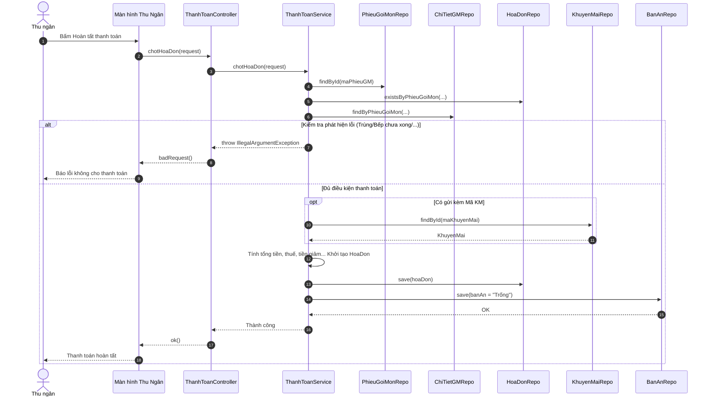

# SQ08 — Hướng dẫn vẽ sequence: Lập hóa đơn và ghi nhận thanh toán

Ngày: 03/10/2026. Phạm vi: hướng dẫn vẽ thủ công trong Enterprise Architect (EA), ở mức chi tiết code (Controller, Service, Repository).

## 1. Mục tiêu, điểm bắt đầu và điểm kết thúc

**Mục tiêu:** Thu ngân kiểm tra bàn đang ăn, áp dụng khuyến mãi (nếu có), xuất hóa đơn và chốt tiền, trả bàn về trạng thái Trống.
**Bắt đầu:** Thu ngân bấm nút "Hoàn Tất Thanh Toán" (Chốt Hóa Đơn) cho một phiếu gọi món đang phục vụ.
**Thành công:** Kiểm tra không còn món nào chưa phục vụ xong. Tính tổng tiền, thuế, khuyến mãi. Lưu `HoaDon` xuống DB, cập nhật `BanAn` thành Trống.
**Không thành công:** Đã xuất hóa đơn rồi, Khuyến mãi hết hạn/không tồn tại, hoặc Bếp vẫn chưa nấu xong toàn bộ món ăn.

## 2. Các thành phần cần đặt trong EA (Lifelines)

| Thứ tự | Tên hiển thị | Loại/vai trò | Trách nhiệm |
| --- | --- | --- | --- |
| 1 | Thu ngân | Actor | Khởi xướng yêu cầu thanh toán (Click "Hoàn Tất Thanh Toán"). |
| 2 | Màn hình Thu Ngân | Boundary (View) | Gửi `ChotHoaDonRequest`. |
| 3 | ThanhToanController | Control (Controller) | Nhận API POST `/chot-hoa-don`. |
| 4 | ThanhToanService | Control (Service) | Tính toán tiền, kiểm tra điều kiện chốt, tạo hóa đơn, đổi trạng thái Bàn. |
| 5 | PhieuGoiMonRepository| Entity (Repository) | Truy vấn lấy phiếu. |
| 6 | HoaDonRepository | Entity (Repository) | Kiểm tra chống trùng và Lưu hóa đơn. |
| 7 | ChiTietGoiMonRepository| Entity (Repository) | Lấy danh sách món để tính tổng tiền và kiểm tra trạng thái bếp. |
| 8 | KhuyenMaiRepository | Entity (Repository) | Lấy tiền giảm (nếu có truyền `maKhuyenMai`). |
| 9 | BanAnRepository | Entity (Repository) | Cập nhật bàn về "Trống". |

## 3. Thông tin gửi và kiểm tra nghiệp vụ

**Dữ liệu gửi:** Đối tượng `ChotHoaDonRequest` (gồm `maPhieuGM`, `maKhuyenMai` tùy chọn).

| Trường/quy tắc | Kiểm tra xử lý trong mã nguồn |
| --- | --- |
| Chống thanh toán 2 lần | `hoaDonRepository.existsByPhieuGoiMon_MaPhieuGM(maPhieuGM)` -> Lỗi nếu tồn tại. |
| Bếp nấu xong chưa? | Quét qua `chiTietGoiMons`, nếu có món `!"Đã xong".equals(ct.getTrangThaiBep())` -> Báo lỗi. |
| Khuyến mãi | Nếu có `maKhuyenMai`, lấy ra từ `khuyenMaiRepository`. Lỗi nếu không có hoặc `isBefore(now())`. |
| Công thức tính | `TongTien` = Sum(DonGia * SoLuong). `VAT` = `TongTien` * 8%. `TongThanhToan` = `TongTien` + `VAT` - `KhuyenMai`. (Nếu < 0 thì = 0). |
| Trả bàn | `BanAn.setTrangThai("Trống")` và gọi `banAnRepository.save(ban)`. |

## 4. Thứ tự thông điệp để vẽ

Do luồng phức tạp, có thể dùng nhiều `alt` nối tiếp (hoặc bao quanh). Ở đây mô tả dạng gom gọn các nhánh kiểm tra lỗi vào một `alt` để tập trung vào logic xử lý chính.

| Mã | Từ → Đến | Nhãn trên mũi tên (Tên hàm/Tham số) | Vị trí/ý nghĩa |
| --- | --- | --- | --- |
| M01 | Thu ngân → Màn hình Thu Ngân | Bấm "Hoàn Tất Thanh Toán" | (Asynchronous) |
| M02 | Màn hình Thu Ngân → ThanhToanController | `chotHoaDon(request)` | (Synchronous) POST API |
| M03 | ThanhToanController → ThanhToanService | `chotHoaDon(request)` | (Synchronous) |
| M04 | ThanhToanService → PhieuGoiMonRepository | `findById(maPhieuGM)` | (Synchronous) |
| M05 | PhieuGoiMonRepository → ThanhToanService | Trả về `PhieuGoiMon` | (Return) |
| M06 | ThanhToanService → HoaDonRepository | `existsByPhieuGoiMon_MaPhieuGM()`| (Synchronous) Check trùng HD |
| M07 | HoaDonRepository → ThanhToanService | Trả về `boolean` | (Return) |
| M08 | ThanhToanService → ChiTietGoiMonRepository | `findByPhieuGoiMon_MaPhieuGM()`| (Synchronous) Lấy món ăn |
| M09 | ChiTietGoiMonRepository → ThanhToanService | Trả về danh sách `ChiTietGoiMon` | (Return) |
| **Fragment** | **`alt` (Lỗi Validate / Bếp chưa xong)** | `[Trùng HD hoặc Có món chưa xong hoặc Lỗi KM]` | |
| M10 | ThanhToanService → ThanhToanController | Ném `IllegalArgumentException` | (Return) |
| M11 | ThanhToanController → Màn hình Thu Ngân | `ResponseEntity.badRequest(msg)` | (Return) |
| M12 | Màn hình Thu Ngân → Thu ngân | Hiển thị lỗi (Ví dụ "Bàn vẫn còn món...")| (Asynchronous) |
| **Fragment** | **`[else]` (Điều kiện đạt)** | `[Mọi thứ hợp lệ]` | |
| **Fragment** | **`opt` (Có dùng khuyến mãi)** | `[maKhuyenMai != null]` | |
| M13 | ThanhToanService → KhuyenMaiRepository | `findById(maKM)` | (Synchronous) |
| M14 | KhuyenMaiRepository → ThanhToanService | Trả về `KhuyenMai` | (Return) |
| M15 | ThanhToanService → ThanhToanService | Tính toán TongTien, VAT, ThanhToan | (Self-message) |
| M16 | ThanhToanService → ThanhToanService | Khởi tạo `HoaDon` | (Self-message) |
| M17 | ThanhToanService → HoaDonRepository | `save(hoaDon)` | (Synchronous) Lưu DB |
| M18 | HoaDonRepository → ThanhToanService | Đã lưu | (Return) |
| M19 | ThanhToanService → BanAnRepository | `save(ban)` (set "Trống") | (Synchronous) Trả bàn |
| M20 | BanAnRepository → ThanhToanService | Đã lưu | (Return) |
| M21 | ThanhToanService → ThanhToanController | Trả chuỗi thành công | (Return) |
| M22 | ThanhToanController → Màn hình Thu Ngân | `ResponseEntity.ok(msg)` | (Return) |
| M23 | Màn hình Thu Ngân → Thu ngân | Hiện thông báo, đẩy ra trang chủ | (Asynchronous) |

## 5. Phác thảo bố cục bằng văn bản (Mermaid)

## 6. Các note nên gắn và thứ tự dựng sơ đồ
1. Gắn Note ở `alt`: **"Phải duyệt toàn bộ ChiTietGoiMon, nếu có món !"Đã xong" thì ném Exception chặn xuất Hóa đơn."**
2. Gắn Note ở `opt`: **"Thuế suất lấy cố định 8%. Tổng tiền = Tổng giá món. Khuyến mãi được trừ cứng tiền mặt."**
3. Gắn Note ở BanAnRepo: **"Kết thúc nghiệp vụ, bàn ăn được tự động đưa về trạng thái Trống để đón khách mới."**

## 7. Kiểm tra trước khi hoàn tất
- [x] Đã phản ánh được thao tác liên đới (Cascading business logic): Lưu hóa đơn xong phải Cập nhật lại Trạng thái Bàn.
- [x] Rõ ràng luồng gọi nhiều Repositories để phục vụ validation chéo.
- [x] Có `opt` cho Khuyến mãi vì Khuyến mãi là `null` able (có hoặc không).
